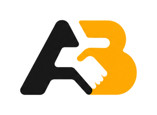
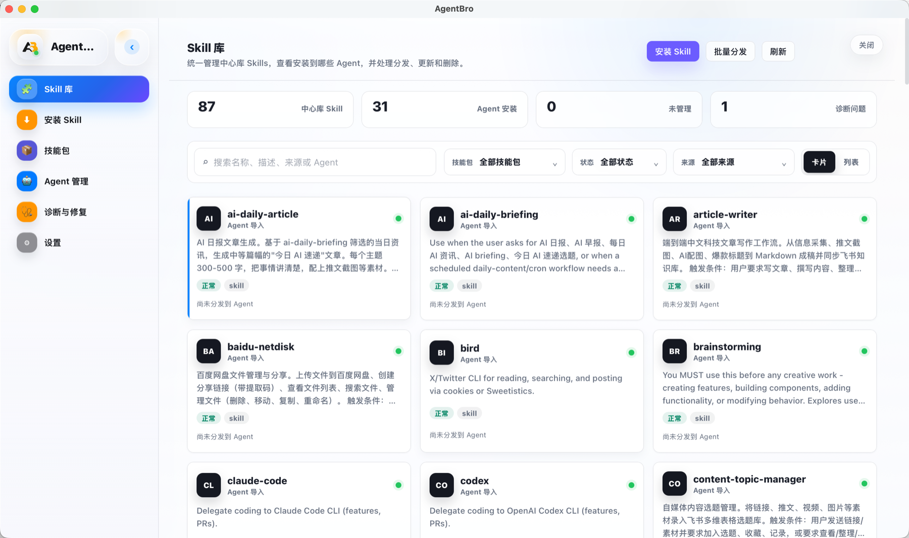
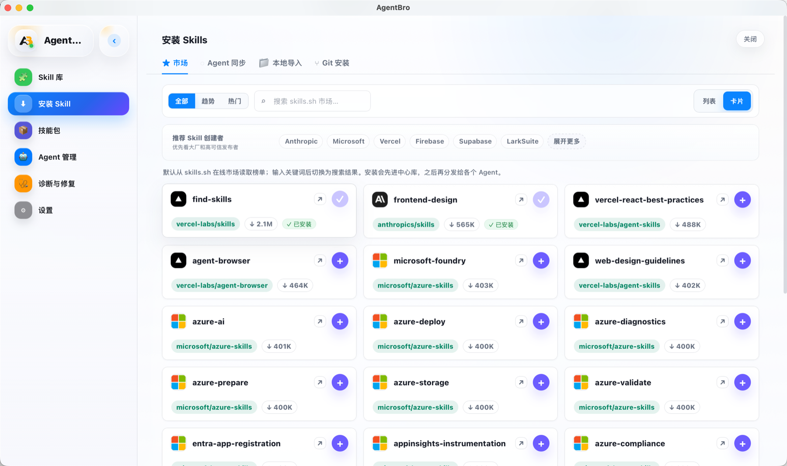
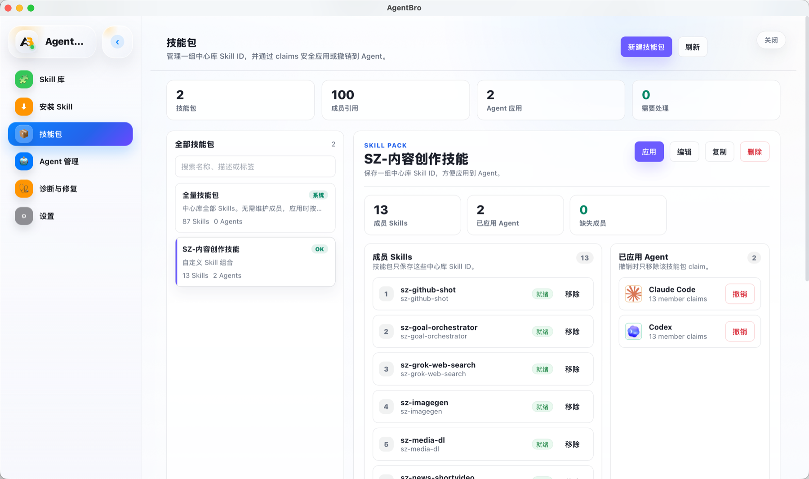
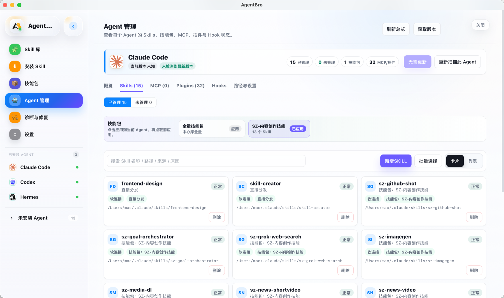

<div align="center">
  

  <h1>AgentBro</h1>

  <p><strong>让 Agent 更好用</strong></p>

  <p>
    面向 AI 编程 Agent 的 macOS 灵动岛。<br />
    把权限请求、问题、计划、工具调用、快速回复、远程会话、完成提醒，以及 Agent 安装、Hook 和 Skills 管理，收进一个轻巧的桌面工作台。
  </p>

  <p>
    <a href="https://www.agentbro.net">官网</a>
    ·
    <a href="https://github.com/shirenchuang/agentbro/releases">下载</a>
    ·
    <a href="docs/privacy-policy.md">隐私</a>
    ·
    <a href="README.en.md">English</a>
  </p>

  <p>
    
    
    
  </p>

  <p>
    <strong>Claude Code / Codex / Gemini CLI / Cursor / Copilot / Kimi / Qoder / OpenCode 等 AI 编程 Agent 的本地控制台。</strong>
  </p>
</div>


## 快速开始

```bash
brew tap shirenchuang/tap && brew install --cask agentbro
```

- 下载：[`GitHub Releases`](https://github.com/shirenchuang/agentbro/releases) 或 [国内最新 DMG](https://agentbro.oss-cn-hangzhou.aliyuncs.com/AgentBro_latest_universal.dmg)。
- 接入：打开 **Island -> Integration**，运行 **Hook Doctor**，再安装你正在使用的 Agent Hook。
- 贡献：看 [`good first issue`](https://github.com/shirenchuang/agentbro/issues?q=is%3Aissue%20is%3Aopen%20label%3A%22good%20first%20issue%22) 或 [`help wanted`](https://github.com/shirenchuang/agentbro/issues?q=is%3Aissue%20is%3Aopen%20label%3A%22help%20wanted%22)。

如果 AgentBro 帮你减少了在终端、编辑器和权限弹窗之间来回切换的时间，欢迎点一个 Star，帮助更多 AI 编程 Agent 用户发现它。

## AgentBro 是什么？

AgentBro 是一个悬浮在编辑器和终端上方的原生 macOS 应用。它会实时观察 Claude Code、Codex、Gemini CLI 等 AI 编程 Agent 的会话状态，把最容易打断心流的事情集中到一个灵动岛里处理。你可以直接在弹窗里批准权限、回答问题、回复消息，也可以把 SSH 远程机器上的 Agent 会话转发回本机查看。

除了运行时浮窗，AgentBro 现在也提供 **Agent 管理** 工作台：自动扫描本机 CLI 和桌面 Agent，统一查看安装状态、版本、Hook、Skills、MCP、插件和路径配置，把散落在不同工具目录里的能力收拢到一个本地优先的控制面板。

## Logo 含义

AgentBro 的 Logo 中间是一个握手造型，代表人和 AI Agent 之间的协作关系：不是替代，也不是遥控，而是像 bro 一样在旁边接力、提醒、兜底。外层的 `A` / `B` 结构来自 AgentBro 的首字母，也像两个 Agent 节点连接在一起。

## 演示视频

### 交互演示

https://github.com/user-attachments/assets/df857822-ea0a-4745-a0b9-80f265f30dc6

### 多主题演示

https://github.com/user-attachments/assets/374d6e53-c126-41be-a593-4e5f63485602

## 支持的主题

| 主题 | ID | 风格 |
| --- | --- | --- |
| 午夜 | `midnight` | 默认深色主题，适合长时间编码和夜间使用。 |
| AgentBro 经典 | `ink-amber` | 品牌经典暖色主题，强调墨色与琥珀色对比。 |
| 磨砂玻璃 | `frosted-glass` | 轻量浅色玻璃质感，适合明亮桌面环境。 |
| 苹果 | `apple` | 干净的 macOS 系统风格，低干扰、偏原生。 |
| 烟灰 | `smoke` | 中性浅色主题，降低色彩刺激，适合持续监控。 |
| 海雾 | `ocean-mist` | 冷色浅色主题，以蓝色强调状态与操作。 |
| 暖纸 | `warm-paper` | 温暖纸感主题，适合偏柔和的桌面搭配。 |
| 柔薰衣草 | `soft-lavender` | 柔和紫色主题，偏轻盈、低对比。 |
| 跟随系统 | `system` | 跟随系统浅色 / 深色外观自动切换。 |

## 主要功能

| 功能 | 说明 |
| --- | --- |
| 灵动岛浮窗 | 支持紧凑、悬停、展开和详情视图，随时查看 Agent 状态。 |
| 即时处理 | 在浮窗中处理权限请求、问题、计划审批、完成提醒和回复卡片。 |
| 快速回复 | 不切回终端，也可以直接在弹窗里输入消息，继续和 Agent 对话。 |
| 任务感知 | 展示工具调用、Subagent 活动、任务摘要，以及支持场景下的 Token / Rate Limit 信息。 |
| Agent 管理 | 自动扫描本机 AI 编程工具，统一查看安装状态、版本、路径、Hook、Skills、MCP 和插件。 |
| Skill 中心库 | 接管散落在不同 Agent 目录里的 Skills，并按软链接或拷贝分发到 Agent 或项目。 |
| 宠物模式 | 把灵动岛切换成宠物状态面板，宠物活力随上下文压力和 Token 用量变化。 |
| 宠物市场 | 浏览社区宠物、一键安装，由 abpets CLI 驱动。详见 [www.agentbro.net/pets](https://www.agentbro.net/pets)。 |
| Hook 集成 | 一键安装 Hook，按 Agent 查看接入状态和事件开关，内置 Hook Doctor 诊断。 |
| 桌面体验 | 支持全局快捷键、声音、通知、主题、显示器位置和终端焦点智能降噪。 |
| 本地优先 | Hook Server 默认运行在本机，支持 `/tmp/agentbro-<uid>.sock` 或 `127.0.0.1:17894`。 |
| SSH Remote | 支持把远程 SSH 机器上的 Agent 事件转发回本机灵动岛，适合远程开发场景。 |
| Webhook 通知 | 支持钉钉 / 飞书 Webhook 通知。 |

## 宠物市场

除了灵动岛,AgentBro 还可以把浮窗切换成 **宠物状态面板**:一只桌面宠物会跟随当前活跃的 Agent,它的活力会随上下文压力和 Token 用量实时变化,让你一眼看出会话是轻松还是吃紧。

**宠物市场** 让你浏览社区贡献的宠物并一键安装,整个流程由 [`abpets`](https://www.npmjs.com/package/abpets) CLI 驱动(基于 Node.js v18+)。在设置面板的 **Island -> 宠物市场** 即可打开,也可以在网页上预览全部宠物:

👉 **[www.agentbro.net/pets](https://www.agentbro.net/pets)**

想自己创作宠物，可以使用 [`shirenchuang/agentbro-pet`](https://github.com/shirenchuang/agentbro-pet) Skill：它会把角色概念、品牌线索或参考图生成 AgentBro 可用的 `pet.json` + `spritesheet.webp` 宠物包，并支持接入不同的生图后端。可通过 `npx skills add https://github.com/shirenchuang/agentbro-pet.git` 安装，也可以直接克隆；Codex、Claude Code、Cursor、Gemini CLI 等任意能运行脚本和生成图片的 Agent 都可以使用。


## Agent 管理

如果你同时在用 Claude Code、Codex、Gemini CLI、Cursor、Kimi、豆包、Qoder、OpenCode 等工具，AgentBro 可以把这些 Agent 的安装、接入、能力包和本地配置收进同一个工作台。入口在设置里的 **Agent管理**，里面包含 Skill 库、安装 Skill、技能包、项目、Agent 管理、诊断与修复等页面。

- 安装与版本：检测 CLI / 桌面 App 是否可用、当前版本、最新版本、可执行文件、配置目录和官方安装页；支持的 CLI 可以直接安装或更新，不支持自动安装的 App 会打开下载页。
- Hook 接入：按 Agent 安装 / 卸载 Hook，查看 Bridge 命令和配置路径，并按审批、通知、生命周期、活动等事件分组开关。
- Skill 中心库：扫描每个 Agent 的 Skills 目录，把未管理的 Skill 接管到中心库，再按软链接或拷贝分发到指定 Agent。
- 技能包：把一组 Skills 做成可复用包，在 Agent 详情页一键应用或撤销；遇到冲突时可以选择覆盖、跳过或以 Agent 现有副本为准。
- MCP、插件与路径：同屏查看 MCP server、插件、配置文件、Skills 目录和健康状态；项目页还可以导入 repo，检查项目级指令文件和 Agent 配置。

<table>
  <tr>
    <td width="50%">
      
      <sub>Skill 库：集中查看中心库 Skills、分发状态和诊断问题。</sub>
    </td>
    <td width="50%">
      
      <sub>安装 Skill：从市场、Agent、本地目录或 Git 仓库导入。</sub>
    </td>
  </tr>
  <tr>
    <td width="50%">
      
      <sub>技能包：把一组 Skills 应用到多个 Agent，并保留可撤销记录。</sub>
    </td>
    <td width="50%">
      
      <sub>Agent 管理：按 Agent 查看 Skills、MCP、插件、Hooks 和路径。</sub>
    </td>
  </tr>
</table>

## 支持的 Agent

AgentBro 对不同 Agent 的支持分为两层：运行时 Hook 适配器负责把会话事件送进灵动岛；Agent 管理会继续扫描更多 CLI / App、Skills、MCP、插件和路径。

| 范围 | Agent |
| --- | --- |
| 灵动岛 / Hook 深度接入 | Claude Code、Codex、Gemini CLI、Cursor / Cursor CLI、GitHub Copilot、Cline、Qoder / Qoder CLI、CodeBuddy / CodeBuddy CN、Qwen、Kimi、DeepSeek、OpenCode、Factory Droid、StepFun、AntiGravity、WorkBuddy、Hermes、Pi、Kiro |
| Agent 管理扫描 | 上面所有 Agent，另支持豆包、`.agents` 共享目录、Junie、Windsurf、Augment、KiloCode、OB1、Amp、Aider、OpenClaw / QClaw / EasyClaw / AutoClaw，以及自定义 Agent |
| 项目级扫描 | 目前聚焦 Claude Code 与 Codex 常见项目配置：项目级 Skills、MCP、插件和指令文件 |

豆包 macOS 支持会检测 `/Applications/Doubao.app`、管理 `~/Doubao/skills`，并继续通过中心库覆盖豆包兼容的 `~/.agents/skills`。由于豆包目前没有公开 Hook，灵动岛中的任务状态来自本机进程与两个任务存储目录的只读元数据关联，不读取聊天内容；该状态属于尽力推断，页面同步可能造成短暂误报。

## 路线图

AgentBro 会坚持本地优先：当前公开版先把灵动岛、Agent 管理、Skill 中心库、Hook 集成、快速处理和 SSH Remote 做扎实。后续希望继续探索：

- 远程同步：跨设备同步设置、Hook、主题、Prompt、Skills 和远程主机配置。
- 技能社区：发现、安装、分享和更新面向不同 Agent 的 Skill Pack。
- 宠物生态：上架更多社区宠物、丰富宠物市场,并开放自定义宠物的创作与分享流程。
- 团队协作：共享配置、团队 Skill 包、权限控制和更清晰的协作视图。

## 加入交流群

如果你正在使用 AgentBro，或者想参与后续 Windows、更多 Agent 深度适配、Agent Monitor、Agent Switch、Skills 社区等模块讨论，可以扫码添加微信，备注 **AgentBro 交流群**，或直接扫码加入 **AgentBro 开源社区** 群聊。

<div align="center">
  <table>
    <tr>
      <td align="center">
        <br />
        <sub>添加微信备注 <b>AgentBro 交流群</b></sub>
      </td>
      <td align="center">
        <br />
        <sub>群聊：<b>AgentBro 开源社区</b>（二维码 7 天有效，过期后请联系微信邀请）</sub>
      </td>
    </tr>
  </table>
</div>

## 平台支持

AgentBro 当前优先开发和测试 **macOS** 版本，并提供早期 **Windows MVP** 安装包。

Windows 版本已经具备基础悬浮窗口、Hook 传输、路径探测和安装包构建能力，但仍属于早期支持；签名、SmartScreen 体验、自动更新和部分 Agent 深度集成还会继续完善。

Linux 后续也可以支持，但不属于第一个公开版本的目标。

## 安装

### Homebrew Cask

一行安装：

```bash
brew tap shirenchuang/tap && brew install --cask agentbro
```

分步安装：

```bash
brew tap shirenchuang/tap
brew install --cask agentbro
```

### 下载发行版

- 🇨🇳 macOS 国内直链（推荐，速度快）：[下载最新 DMG](https://agentbro.oss-cn-hangzhou.aliyuncs.com/AgentBro_latest_universal.dmg)
- Windows 安装包：在 [GitHub Releases](https://github.com/shirenchuang/agentbro/releases) 下载 `AgentBro_latest_x64-setup.exe` 或 `AgentBro_latest_x64.msi`
- 🌍 海外 / 全部版本：[GitHub Releases](https://github.com/shirenchuang/agentbro/releases)

## 本地开发

### 环境要求

- macOS
- Node.js
- pnpm
- Rust toolchain + Cargo
- Tauri CLI：`cargo tauri --version`

### 启动项目

```bash
git clone https://github.com/shirenchuang/agentbro.git
cd agentbro
pnpm install
pnpm tauri:dev
```

`pnpm tauri:dev` 会启动 `http://localhost:1423` 上的 Vite 开发服务，并打开 AgentBro 原生窗口。

### 只调试浏览器 UI

```bash
pnpm dev
```

打开：

- 灵动岛 UI：`http://localhost:1423`
- 设置面板：`http://localhost:1423/#settings`

浏览器开发模式内置了 Claude Hook UI Lab，可以切换权限请求、计划审批、问题、完成提醒、紧凑模式、列表模式和详情模式等静态场景。

### 常用命令

```bash
pnpm test:run      # 运行测试
pnpm test          # 监听模式运行测试
pnpm lint          # ESLint
pnpm build         # 类型检查并构建前端
cargo check        # 检查 Rust 后端
pnpm tauri:build   # 构建 Tauri 应用
pnpm tauri:build:windows # 构建 Windows NSIS/MSI 安装包
./build.sh         # 构建通用 macOS DMG
```

## 接入 Agent

1. 打开 AgentBro 设置。
2. 如果只想接入灵动岛，进入 **Island -> Integration**，运行 **Hook Doctor**。
3. 点击 **Install All Hooks**，或只安装你正在使用的 Agent Hook。
4. 如果想统一管理 Agent、Skills、MCP 和插件，进入 **Agent管理**，再选择 **Agent 管理** 页。
5. 选择一个 Agent，安装 / 更新它，或打开安装页；在 **Hooks** 页安装 Hook，在 **Skills** 页扫描、接管、分发或删除 Skills。
6. 重启对应的 CLI 会话，再启动 Claude Code、Codex、Gemini CLI 或其他支持的 Agent。

之后 AgentBro 会在灵动岛中展示会话状态、工具调用、权限请求、问题、计划和完成提醒。

## 参与贡献

欢迎提交 Issue 和 Pull Request！

- 贡献指南：[CONTRIBUTING.md](CONTRIBUTING.md)
- 行为准则：[CODE_OF_CONDUCT.md](CODE_OF_CONDUCT.md)
- AI Agent 协作指南：[AGENTS.md](AGENTS.md)
- Claude Code 项目配置：[.claude/CLAUDE.md](.claude/CLAUDE.md)
- 社区讨论：[GitHub Discussions](https://github.com/shirenchuang/agentbro/discussions)
- 新手任务：[`good first issue`](https://github.com/shirenchuang/agentbro/issues?q=is%3Aissue%20is%3Aopen%20label%3A%22good%20first%20issue%22) / [`help wanted`](https://github.com/shirenchuang/agentbro/issues?q=is%3Aissue%20is%3Aopen%20label%3A%22help%20wanted%22)

PR 请提到 `dev` 分支，提交前跑一遍 `pnpm lint && pnpm test:run && pnpm build && cargo check --manifest-path src-tauri/Cargo.toml`。

## 发布

发布说明和签名要求见 [`docs/release.md`](docs/release.md)。

- 官网：[www.agentbro.net](https://www.agentbro.net)
- 国内直链：`https://agentbro.oss-cn-hangzhou.aliyuncs.com/AgentBro_latest_universal.dmg`
- GitHub Releases：`https://github.com/shirenchuang/agentbro/releases`

## 开源协议

AgentBro 代码基于 [Apache License 2.0](LICENSE) 开源。

AgentBro 名称、Logo、应用图标、官网视觉和其他品牌资产不随代码授权开放。修改版或分发版请使用不同名称，避免和官方项目产生混淆，并遵守 [NOTICE](NOTICE) 和 [TRADEMARKS.md](TRADEMARKS.md)。
