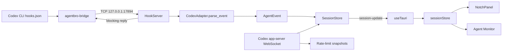

# Control Tower Phase 0 Windows Baseline

## Scope

This baseline records the current AgentBro architecture before Control Tower
product work begins. Phase 0 intentionally makes no runtime or product changes.

- Upstream: <https://github.com/shirenchuang/agentbro>
- Baseline commit: `d03145cd2876c64841a202b0291faeb51d760474`
- Target: Windows x64
- Toolchain: Node.js 22.23.2, pnpm 11.19.0, Rust 1.98.0 (MSVC)

## Validation

| Check | Result | Notes |
| --- | --- | --- |
| `pnpm install --frozen-lockfile` | Pass | Existing lockfile used |
| `pnpm lint` | Pass | No lint errors |
| `pnpm test:run` | Pass | 53 files, 649 tests |
| `pnpm build` | Pass | Vite production build |
| `cargo check --manifest-path src-tauri/Cargo.toml` | Pass | 21 existing dead-code warnings |
| `pnpm build:bridge` | Pass | Windows bridge executable built |
| Native startup | Pass | Hook server listened on `127.0.0.1:17894`; the Tauri process and 420×52 island window stayed responsive |
| Codex Hook → visible Island | Partial | The empty island was transparent as designed, but an injected test event did not become a visible session |

The last visual check should not be repeated against a normal Windows profile
until startup can suppress automatic hook installation. Overriding
`USERPROFILE`, `APPDATA`, and `LOCALAPPDATA` isolated WebView/app data but did
not isolate the Windows home directory used for agent hook discovery. Native
startup therefore installed Claude hooks in the real profile. Those test
changes and all temporary runtime data were removed after validation.

## Current event flow

There are two Codex ingestion paths:

1. Hooks are the primary real-time path. The compiled bridge normalizes hook
   payloads, forwards one JSON line to the local hook server, and keeps the
   connection open for approvals or questions.
2. Codex app-server synchronization supplements hooks with thread state,
   approvals, questions, steering, and account rate limits.

Both paths converge on the backend `SessionStore`. The frontend Zustand store
is a UI projection, not the system of record.

## Existing boundaries

| Boundary | Current responsibility | Control Tower rule |
| --- | --- | --- |
| Agent adapters | Install/remove hooks and normalize provider payloads into `AgentEvent` | Keep provider-specific parsing here |
| Bridge and hook server | Local transport, blocking replies, raw-event ring buffer | Keep transport separate from product models |
| `SessionStore` | Live session state and `session-update` broadcasts | Reuse for live state; do not turn it into durable history |
| Island | Compact active-session state, approvals, questions, and completion overlays | Keep it a projection of task state |
| Agent Monitor | Session summaries, detail, timeline, and transcript views | Rebuild its timeline from durable trace data when available |
| Notifications | Native completion/error/attention delivery | Trigger from normalized state transitions |
| Usage readers | Codex rate-limit snapshots with JSONL fallback and source metadata | Preserve source and freshness; never invent cost |

## Minimal extension points

No new abstraction is required in Phase 0. The next implementation should add
durable product data behind the existing event pipeline:

- **Task:** derive a stable task ID, parent/child relationship, agent, run, and
  status from normalized events and sessions; persist it in SQLite.
- **Trace:** append normalized events with timestamp, source, session/task IDs,
  and an optional raw-event reference; make Monitor a projection of this log.
- **Usage:** persist provider snapshots with `source`, `updated_at`, and
  freshness/estimate flags. Only calculate currency cost when both model usage
  and pricing are trustworthy.

Adapters should remain inputs. `SessionStore` should remain the live cache.
Task, Trace, and Usage should be backend domain records exposed through Tauri
commands/events; the frontend should not duplicate their business logic.

## Known gaps and risks

1. The current startup path may automatically modify agent hook files. A safe
   development/test mode is needed before repeatable native E2E testing.
2. `SessionStore`, raw-event history, and derived task/tool state are in memory;
   there is no durable Task/Trace model.
3. Current usage data describes quota windows, not trustworthy per-task cost;
   several provider readers are declared but not wired.
4. Windows Hook → visible Island remains an open E2E check.
5. Redistribution requires replacing the AgentBro product name and identity;
   branding work is outside this baseline.

## Phase 1 entry

The smallest safe first change is an explicit development/test startup mode
that skips automatic hook installation and accepts isolated agent/app data
paths. After that check is repeatable, implement the minimal SQLite Task and
Trace records on the existing `AgentEvent` → `SessionStore` path.
