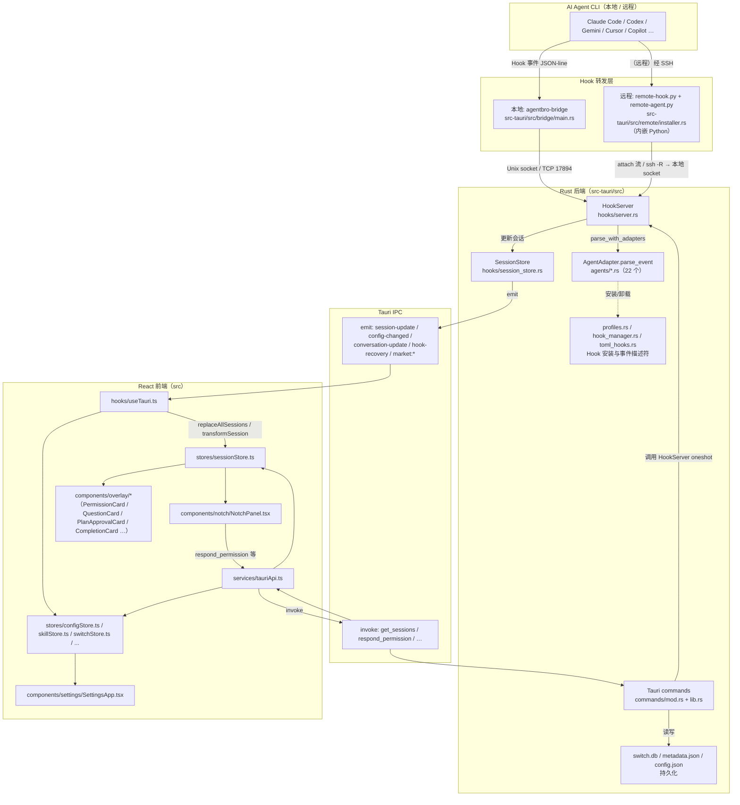

# 02 — 系统架构

> 评测模型：GLM-5.1 · 生成日期：2026-06-13
> 本章重点串起这条链路：`src-tauri/src/hooks/* → Rust command/event → src/services/tauriApi.ts → Zustand stores → Notch/Overlay UI`。每个模块都给出关键文件路径。

---

## 2.1 顶层架构图（Mermaid）

---

## 2.2 各模块职责

### 2.2.1 AI Agent CLI（事件源）
Agent（如 Claude Code）在运行时触发 Hook，调用 AgentBro 注入的 Hook 命令，把 JSON 事件发给 AgentBro。
- 本地走编译版 `agentbro-bridge`（`src-tauri/src/bridge/main.rs`）。
- 远程走 Python 脚本 `remote-hook.py` / `remote-agent.py`（源码内嵌在 `src-tauri/src/remote/installer.rs:564+ / 1086+`，经 SSH 上传到远程 `~/.agentbro/`）。

### 2.2.2 Hook 转发层（Bridge）
- `agentbro-bridge`（`src-tauri/Cargo.toml:14-16` 的 `[[bin]]`）：读 stdin JSON，stamp `agent` 字段（`bridge/main.rs:747`），通过 `UnixStream`/`TcpStream` 连到本地 HookServer（`bridge/main.rs:440`），对 `PermissionRequest` 等会等待一行回应。
- 远程两条传输路径（`remote/manager.rs:171-272`）：**attach 模式**（主，ssh 跑远程 daemon 把 JSON 流回本地 socket，`remote/attach.rs`）与 **ssh -R 反向隧道**（回退，`remote/ssh_tunnel.rs`）。

### 2.2.3 Rust 服务层（`src-tauri/src`）

**HookServer（`hooks/server.rs`，3616 行）**——事件汇聚中枢：
- 同时监听 Unix socket 与 TCP（`start()` at `server.rs:769`）。
- `handle_connection`（`server.rs:873`）读一行 JSON → `parse_with_adapters`（`server.rs:1487-1506`，先按 `raw["agent"]` 精确路由，再回退遍历所有适配器）→ 更新 `SessionStore`。
- 对 `PermissionRequest`/`AskQuestion`/`PlanApproval` 三类**阻塞型交互**，建 `oneshot::channel` 等待 UI 回应，再写回 Hook 脚本（`server.rs:931-1275`）。
- 副作用：播放声音、发系统通知、转发 Webhook（钉钉/飞书，含延迟提醒 `schedule_delayed_webhook` at `server.rs:645`）。
- 维护每会话原始事件环形缓冲（`RawHookEventStore`，`server.rs:74-121`，每会话 200 条）供 Agent Monitor 诊断。

**SessionStore（`hooks/session_store.rs`）**——会话状态真相源：
- 持有所有 `SessionState`，每个变更 mutator（`set_pending_permission`、`update_phase`、`add_tokens`、`set_rate_limits`…约 20 处）末尾调用 `emit_update()`（`session_store.rs:874`）→ `emit_update_with_suppression` → `handle.emit("session-update", &payload)`（`session_store.rs:885-893`）。

**AgentAdapter（`agents/traits.rs`）**——扩展点 #1：
- trait 共 **8 个必需方法**：`name`、`display_name`、`icon`、`install_hooks`、`remove_hooks`、`status`、`parse_event`、`hook_config_paths`（`traits.rs:7-17`）；外加 2 个默认实现 `hooks_installed`（`traits.rs:18-22`）与 `detect_status_now`（`traits.rs:31-33`，文档注释要求各适配器覆盖）。
- 22 个适配器在 `agents/mod.rs:214-239` 的 `all_adapters()` 注册。
- `AgentEvent` 枚举（`agents/mod.rs`）定义所有事件类型（SessionStart/Processing/ToolUse/PermissionRequest/AskQuestion/PlanApproval/TaskComplete/TokenUsage/RateLimitUpdate/SubagentStart/Stop/Shell/MCP…）。

**Hook 配置注入（`agents/profiles.rs` + `hook_manager.rs` + `toml_hooks.rs`）**：
- `AgentIntegrationProfile` 描述每个 Agent 的配置文件路径、Hook 安装方式、事件描述符。
- 三种格式：JSON（嵌套/扁平）、YAML、TOML。实际 TOML 安装走 `toml_hooks.rs` 的段解析器（`profiles.rs:867-906` 分发；只有 kimi/deepseek 用 TOML）。
- 事件描述符常量：`BASIC_AGENT_EVENTS`、`SESSION_TOOL_EVENTS`、`CODEBUDDY_EVENTS`、`KIMI_EVENTS`（被多适配器复用）。

**commands/mod.rs（`AppState`）**——后端状态聚合：
- `AppState`（`commands/mod.rs:52-70`）持有：`session_store`、`hook_server`、`codex_app_server`（持久 WebSocket 到 `codex app-server`）、`config_store`、`adapters`、`sound_engine`、`conversation_watcher`、`display_controller`、`remote_manager`、`network_monitor`、`switch_db`、`telemetry`、`diagnostic_buffer`。
- 关键命令：`get_sessions`、`respond_permission`（`commands/mod.rs:2352`，回退链 Codex app-server → HookServer → tmux）、`respond_question`、`respond_plan`、`send_message`、`get_chat_history` 等。

**lib.rs（入口 + 注册表，5306 行）**：
- `run()` 构建 `AppState`、启动各后台服务、注册 `invoke_handler`（`lib.rs:5058-5302`，约 250+ 命令）。
- 还承载大量"领域命令"：显示/拖拽、Hook 安装、远程、Webhook、主题、声音、技能、Switch、全局快捷键等。

### 2.2.4 Tauri IPC
- **事件（后端→前端）**：`session-update`、`config-changed`、`conversation-update`、`hook-recovery` / `hook-recovery-failed`、`market:install_log` / `market:install_done`、`tray-open-agentbro`、`island-layout-preview(-clear)`、`switch-deep-link`。
- **命令（前端→后端）**：`get_sessions`、`respond_permission`、`send_message`、`update_config`、`install_agent_hook`、`scan_all_skills`、`switch_*`、`*remote*` 等（详见 `lib.rs:5058-5302`）。
- 错误统一 `Result<T, String>` 跨边界。

### 2.2.5 前端（`src`）

**services/tauriApi.ts（1682 行）**：所有 `invoke()` 的薄封装 + 类型签名 + 浏览器开发模式 stub。例如 `respondPermission`（`:492`）、`sendMessage`（`:525`）、`installAgentHook`（`:1457`）、`addRemoteHost`（`:1531`）、`addWebhook`（`:1635`）。

**hooks/useTauri.ts（962 行）**：事件监听集合。
- `useSessionEvents()`（`:491`，listen 在 `:512`）：监听 `session-update` → `event.payload.sessions.map(transformSession)` → `store.replaceAllSessions(...)`；被抑制时不自动展开。
- `useConfigSync()`（`:547`）：监听 `config-changed` → 更新 `configStore`。
- `useConversationEvents()`（`:820`）：监听 `conversation-update` → 聊天历史。
- `useHookRecovery()`（`:880`）：监听 `hook-recovery(-failed)`。
- `useMarketInstallEvents()`（`:924`）：宠物市场安装日志/完成。

**Zustand stores（`src/stores/`）**：
- `sessionStore.ts`：核心。`sessions` + `sessionList` + `baseLayer`（compact/list/detail）+ `overlayQueue` + `activeOverlay`（= 排序后 `overlayQueue[0]`）。`updateSession(event)` 把 `AgentEvent` 映射成 session 字段并 `pushOverlay` 权限/问题/计划/完成/压缩卡片。
- `configStore.ts`：配置（声音/快捷键/主题/远程主机条目等），多窗口经 `config-changed` 同步。
- `skillStore.ts`、`switchStore.ts`、`petStore.ts`、`themeStore.ts`、`marketStore.ts`、`updateStore.ts`、`agentStore.ts`。

**UI**：
- `components/notch/NotchPanel.tsx`：灵动岛外壳，消费 `selectSessionList/selectActiveOverlay/selectPanelState`，渲染 `CollapsedBar`/`HoverList`/`ChatView` 及 overlay 卡片。
- `components/overlay/*`：`PermissionCard`、`QuestionCard`、`PlanApprovalCard`、`OverlayCompletionCard`、`OverlayResponseCard`、`OverlayCompactingCard`、`OverlayFeedbackPanel`。
- `components/settings/SettingsApp.tsx`：设置窗口，按 `activeSection` 路由 General/Island/Monitor/Switch/Agents/About。

---

## 2.3 核心链路：Hook → Rust command/event → tauriApi → stores → UI

下表把这条链路落到文件级（**代码已确认**）：

| 步骤 | 文件:行 | 动作 |
| --- | --- | --- |
| 1. Agent 触发 Hook | （Agent 侧） | 调用注入的 `agentbro-bridge`（本地）或 `remote-hook.py`（远程） |
| 2. Bridge 转发 | `src-tauri/src/bridge/main.rs:440-480,681-744` | JSON 经 Unix socket/TCP 发给 HookServer |
| 3. HookServer 收事件 | `src-tauri/src/hooks/server.rs:873-930` | 读一行 JSON，`parse_with_adapters` |
| 4. 路由适配器 | `src-tauri/src/hooks/server.rs:1487-1506` | 先按 `agent` 字段精确匹配，再回退遍历 |
| 5. 更新 SessionStore | `src-tauri/src/hooks/session_store.rs`（各 mutator） | 例如 `set_pending_permission` |
| 6. emit 事件 | `src-tauri/src/hooks/session_store.rs:874-893` | `handle.emit("session-update", payload)` |
| 7. 前端监听 | `src/hooks/useTauri.ts:494-535` | `listen('session-update')` → `transformSession` |
| 8. 同步 store | `src/stores/sessionStore.ts` `replaceAllSessions` / `updateSession` | 更新 sessions + overlayQueue |
| 9. UI 渲染 | `src/components/notch/NotchPanel.tsx` + `components/overlay/*` | 从 `selectActiveOverlay` 取最高优先级卡片渲染 |
| 10. 用户操作回写 | `NotchPanel` → `respondPermission`（`tauriApi.ts:492`）→ `commands/mod.rs:2352` | oneshot 回应写回 Hook 脚本 |

---

## 2.4 第二条事件链路：Codex app-server（仅 Codex）

除 Hook 外，Codex 还有一条**持久 WebSocket** 链路（`commands/mod.rs:304-351, 1010-1107` 与 `agents/codex_app_server.rs`）：

- `start_codex_app_server_background_sync` 后台 spawn `codex app-server --listen ws://...`，长连同步 Codex.app 桌面会话的 thread 状态。
- 权限/问题走 `CodexAppServerBridge` 的 mpsc + oneshot 通道（`commands/mod.rs:97-209`）。
- `respond_permission`（`commands/mod.rs:2367-2379`）会**先尝试 Codex app-server**，失败再回退 Hook socket 与 tmux。

> 标注：Codex app-server 是确认存在的第二条链路；其与 Hook 链路的优先级与去重在 `respond_permission` 中通过"先 app-server 再 hook 再 tmux"的串行回退实现（`commands/mod.rs:2367-2437`，已确认）。

---

## 2.5 哪些链路是代码确认的，哪些是推断

**代码已确认**（直接读到行）：
- Hook → HookServer → SessionStore → `session-update` → `useTauri` → `sessionStore` → `NotchPanel`（见 2.3 全链路）。
- `respond_permission` 三级回退链。
- Codex app-server 持久 WebSocket 同步链路。
- 远程 attach / ssh -R 双路径（`remote/manager.rs:171-272`）。
- 22 个适配器、8 必需 trait 方法、`session-update` 在 `session_store.rs:892` emit。

**推断**（基于结构/调用关系，未逐行验证全部调用点）：
- `network_monitor.rs` / `telemetry.rs` 的具体上报触发时机——本章只确认它们被 `AppState` 持有并启动，未追全部触发点。
- `commands/monitor.rs`（Agent Monitor）内部数据装配细节——只确认其命令已注册（`lib.rs:5090-5100`）与 UI `AgentMonitorSection` 可达。
