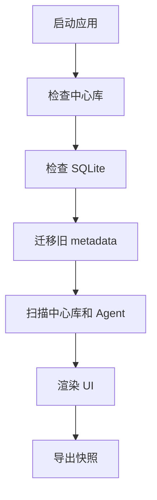
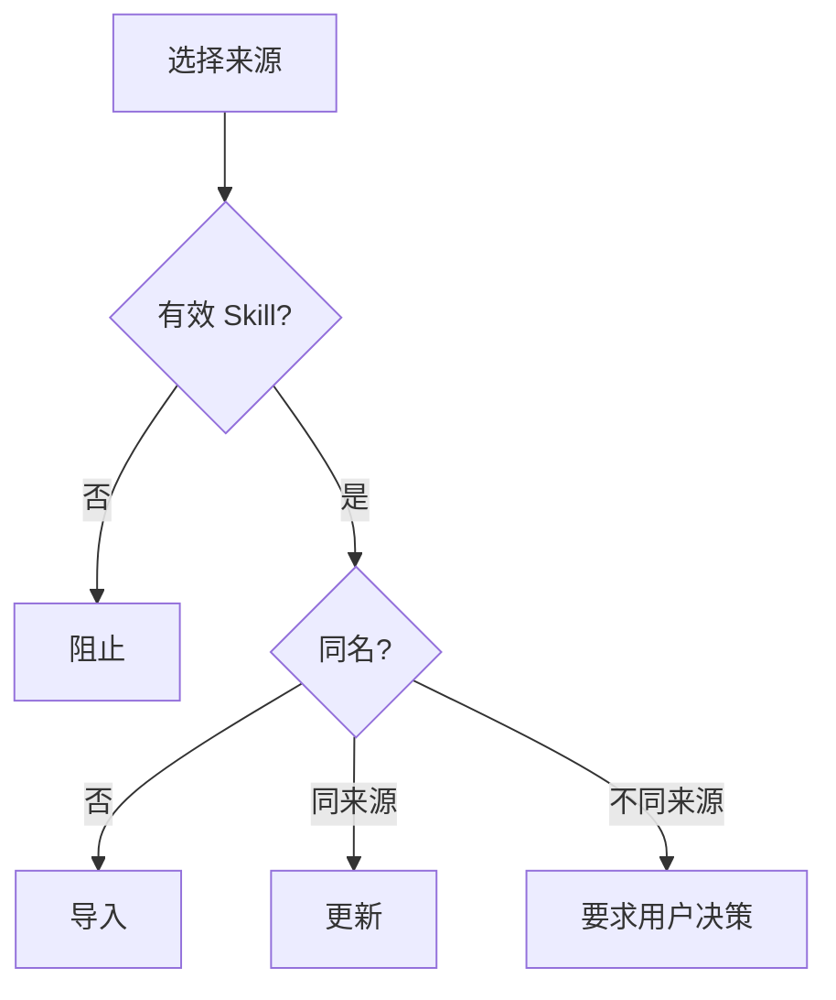
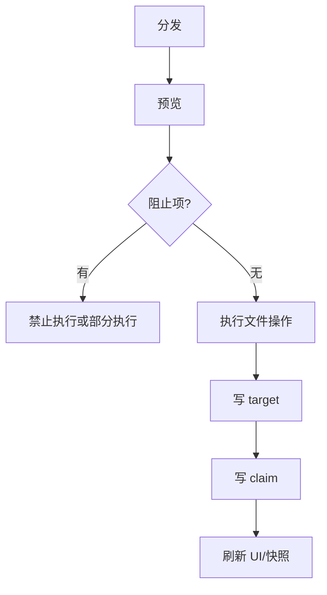
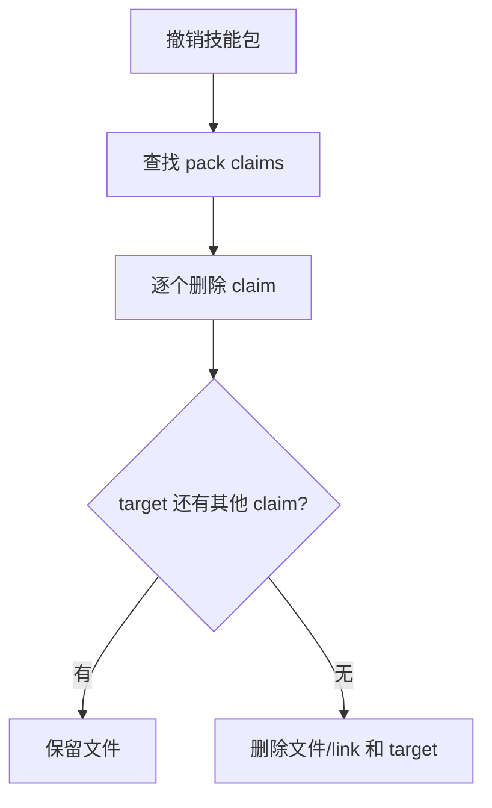
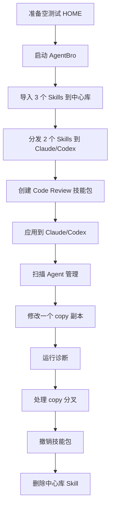

# AgentBro Skill Manager v2 验收标准

状态：Draft for parallel implementation
更新时间：2026-06-13
适用范围：AgentBro 桌面端 Skill 管理模块

## 1. 验收原则

验收以用户行为和数据结果为准，不以 demo 像素为准。

每个功能必须同时满足：

- UI 可见且状态准确。
- Tauri command 返回结构稳定。
- SQLite 数据正确。
- 文件系统结果正确。
- JSON 快照可反映最终状态。
- 操作失败时不破坏已有文件。

## 2. 验收环境

准备临时测试目录，不使用真实用户目录：

- `TEST_HOME/.agentbro/skills`
- `TEST_HOME/.claude/skills`
- `TEST_HOME/.codex/skills`
- `TEST_HOME/.gemini/skills`
- `TEST_HOME/.cursor/skills`

测试 Skill：

- `github-code-review`
- `test-driven-development`
- `database-debugging`
- `release-checklist`
- `skill-authoring`

每个 Skill 至少包含：

- `SKILL.md`
- frontmatter `name` 和 `description`
- 一个额外文件，用于 hash 变化测试

## 3. P0 验收清单

### 3.1 初始化与迁移

| ID | 场景 | 操作 | 期望 |
| --- | --- | --- | --- |
| INIT-01 | 首次启动 | 打开 Skill Manager | 自动创建 `~/.agentbro/skills` 和 SQLite DB。 |
| INIT-02 | 空中心库 | 首次打开 Skill 库 | 显示空状态，不报错。 |
| INIT-03 | 手动复制 Skill 到中心库 | 启动扫描 | 显示为中心库未入库，可一键纳入管理。 |
| INIT-04 | 旧 metadata 存在 | 启动 v2 | sources/packs/scanRoots 被迁移，旧文件不删除。 |
| INIT-05 | 快照生成 | 完成任意写操作 | `agentbro-skills.snapshot.json` 被刷新。 |

### 3.2 Skill 库

| ID | 场景 | 操作 | 期望 |
| --- | --- | --- | --- |
| LIB-01 | 默认视图 | 进入 Skill 库 | 默认展示卡片，不展示 Agent 横向矩阵。 |
| LIB-02 | 卡片内容 | 查看任意 Skill 卡片 | 显示名称、描述、来源、状态、已安装 Agent 图标。 |
| LIB-03 | 列表切换 | 点击“列表” | 切换为列表视图，内容不丢失。 |
| LIB-04 | 卡片切换 | 点击“卡片” | 切回卡片视图。 |
| LIB-05 | 查看详情 | 点击 Skill | 右侧详情更新为该 Skill 的路径、来源、targets、claims。 |
| LIB-06 | 搜索 | 输入关键字 | 列表只显示匹配名称、描述、来源或 Agent 的 Skill。 |
| LIB-07 | 状态筛选 | 选择冲突/可更新/未管理 | 只显示对应状态 Skill。 |
| LIB-08 | 无横向溢出 | 1280px 和 390px 宽度 | 页面无全局横向滚动。 |

验收重点：

- 主区不能出现以 Agent 为列的状态表格。
- 已安装 Agent 只能以图标/短标签展示。
- 点击 Skill 后详情必须联动。

### 3.3 添加到中心库

| ID | 场景 | 操作 | 期望 |
| --- | --- | --- | --- |
| ADD-01 | 本地文件夹导入 | 选择有效 Skill 文件夹 | 复制到中心库，写入 DB source。 |
| ADD-02 | 压缩包导入 | 选择 zip | 解压并导入，临时文件清理。 |
| ADD-03 | 批量导入 | 选择包含多个 Skill 的目录 | 预览多个 Skill，用户确认后导入。 |
| ADD-04 | 同名同来源 | 再次导入同来源 Skill | 作为更新处理。 |
| ADD-05 | 同名不同来源 | 导入同名不同来源 Skill | 默认阻止，显示覆盖/重命名/跳过。 |
| ADD-06 | 非 Skill 目录 | 选择无 `SKILL.md` 目录 | 阻止并说明原因。 |
| ADD-07 | 中心库已有 link targets | 覆盖中心库前预览 | 明确提示 link Agent 会立即受影响。 |

### 3.4 扫描并接管

| ID | 场景 | 操作 | 期望 |
| --- | --- | --- | --- |
| ADOPT-01 | Agent 有未管理 Skill | 运行扫描 | 在诊断和 Agent 管理中显示未管理。 |
| ADOPT-02 | 快速接管 | 选择同 hash Skill | 可接管为 DB target，不重复复制。 |
| ADOPT-03 | 导入中心库 | 选择未入库 Skill | 复制到中心库，记录 `agent_import`。 |
| ADOPT-04 | 替换为 link | 接管后选择 link | Agent 目录变为软链接，DB actual_mode=link。 |
| ADOPT-05 | 替换为 copy | 接管后选择 copy | Agent 目录为 copy，DB actual_mode=copy。 |
| ADOPT-06 | 冲突 | Agent 同名但 hash 不同 | 阻止自动接管，要求覆盖/重命名/保留。 |

### 3.5 分发 link/copy

| ID | 场景 | 操作 | 期望 |
| --- | --- | --- | --- |
| DIST-01 | link 分发 | 将中心库 Skill 分发到 Claude | Agent 目录创建 symlink，target 写入 DB。 |
| DIST-02 | copy 分发 | 将中心库 Skill 分发到 Codex | Agent 目录复制文件，target 写入 DB。 |
| DIST-03 | link 失败 | 模拟无法 symlink | 按设置询问或 fallback copy，actual_mode 准确。 |
| DIST-04 | 已存在已管理 target | 再次分发同 Skill | 复用 target，不重复写文件。 |
| DIST-05 | 已存在未管理同名 | 分发到该 Agent | 阻止，提示先接管/覆盖/重命名。 |
| DIST-06 | direct claim | 直接安装已有 pack target | 追加 direct claim，不删除 pack claim。 |

### 3.6 技能包

| ID | 场景 | 操作 | 期望 |
| --- | --- | --- | --- |
| PACK-01 | 创建技能包 | 填名称并选择 Skills | 保存 pack 和 members。 |
| PACK-02 | 空名称 | 保存 | 阻止并提示名称必填。 |
| PACK-03 | 成员缺失 | 保存或应用 | 提示缺失，不静默忽略。 |
| PACK-04 | 应用技能包 | 选择 2 个 Agent | 为每个成员创建或复用 target，并写 pack claim。 |
| PACK-05 | 重复应用 | 对同 Agent 再应用 | 不重复 claim，不重复写文件。 |
| PACK-06 | 多包叠加 | 两个包包含同 Skill | 同一 target 下存在两个 pack claims。 |
| PACK-07 | 撤销一个包 | 移除 pack A | 只删除 pack A claim，pack B claim 保留，文件保留。 |
| PACK-08 | 撤销最后 claim | 移除最后 claim | 删除 Agent 文件/link 和 target。 |
| PACK-09 | 从包移除 Skill | 包已应用到 Agent | 提示保留为独立安装或同步移除。 |
| PACK-10 | 删除技能包 | 包已应用 | 必须先预览影响，再确认。 |

### 3.7 copy 同步

| ID | 场景 | 操作 | 期望 |
| --- | --- | --- | --- |
| COPY-01 | 中心库更新 | 修改中心库文件 | copy target 显示可更新。 |
| COPY-02 | Agent copy 修改 | 修改 Agent 副本 | 显示 copy 已修改。 |
| COPY-03 | 双边修改 | 中心库和 Agent 都修改 | 显示 copy 分叉，禁止自动覆盖。 |
| COPY-04 | 中心覆盖 Agent | 用户确认 | Agent 副本更新，source_hash 更新。 |
| COPY-05 | Agent 覆盖中心 | 用户确认 | 中心库更新，source 记录 agent_override。 |
| COPY-06 | 保留分叉 | 用户选择 | 不写文件，状态保持分叉。 |

### 3.8 删除

| ID | 场景 | 操作 | 期望 |
| --- | --- | --- | --- |
| DEL-01 | 删除中心库未使用 Skill | 删除 | 删除中心库目录和 DB 记录。 |
| DEL-02 | 删除中心库有 link target | 删除预览 | 显示所有受影响 Agent，默认不直接删除。 |
| DEL-03 | Agent 中删除 Skill | 从 Agent 详情删除 | 只影响该 Agent，不删除中心库。 |
| DEL-04 | 删除有多个 claims 的 target | 删除一个 claim | 文件保留。 |
| DEL-05 | 删除最后 claim | 删除 | 文件/link 被删除，target 被删除。 |
| DEL-06 | 删除未管理 Skill | 用户确认删除 | 只删除该 Agent 中的文件，不影响中心库。 |

### 3.9 Agent 管理

| ID | 场景 | 操作 | 期望 |
| --- | --- | --- | --- |
| AGENT-01 | Agent 列表 | 打开 Agent 管理 | 显示所有已安装/可识别 Agent。 |
| AGENT-02 | Agent 详情 | 点击 Agent | 显示版本、路径、Skills、技能包、MCP、Plugin。 |
| AGENT-03 | 版本信息 | 检查更新 | 显示当前版本和可更新版本或未知状态。 |
| AGENT-04 | MCP 状态 | 读取配置 | 显示 server 名称、命令、校验结果。 |
| AGENT-05 | Plugin 状态 | 读取插件 | 显示已安装插件和异常。 |
| AGENT-06 | 路径健康 | 目录缺失或不可写 | 显示诊断问题。 |

### 3.10 诊断与修复

| ID | 场景 | 操作 | 期望 |
| --- | --- | --- | --- |
| DIAG-01 | 运行诊断 | 点击运行诊断 | 生成问题分组。 |
| DIAG-02 | 未管理 | Agent 目录有未管理 Skill | 显示可接管建议。 |
| DIAG-03 | 坏链接 | link 指向不存在 | 显示坏链接，可一键清理或修复。 |
| DIAG-04 | 失效 target | DB 有记录但文件不存在 | 显示清理建议。 |
| DIAG-05 | copy 分叉 | 双边修改 | 显示需要确认，不进入一键修复。 |
| DIAG-06 | JSON 快照落后 | 修改 DB 后删除快照 | 显示刷新快照建议。 |
| DIAG-07 | 一键修复 | 点击修复安全项 | 只执行低风险 auto 项。 |
| DIAG-08 | 修复后重扫 | 修复完成 | 问题消失或状态更新。 |

## 4. 非功能验收

### 4.1 性能

| ID | 标准 |
| --- | --- |
| PERF-01 | 100 个中心库 Skills、10 个 Agent、1000 个 targets 下，首页加载不超过 2 秒。 |
| PERF-02 | 运行全量扫描不阻塞 UI，显示进度或 loading。 |
| PERF-03 | 卡片/列表切换在 300 个 Skills 内无明显卡顿。 |
| PERF-04 | hash 计算应跳过忽略目录，避免扫描 `node_modules`、`.git`、`target`。 |

### 4.2 可靠性

| ID | 标准 |
| --- | --- |
| REL-01 | 写操作失败不能留下半写 DB 记录。 |
| REL-02 | 文件复制失败要清理临时目录。 |
| REL-03 | link 创建失败要有明确错误和 fallback。 |
| REL-04 | SQLite 损坏时，可通过 JSON 快照恢复基础数据。 |
| REL-05 | 重复执行同一 apply pack 不产生重复 claim。 |

### 4.3 安全与权限

| ID | 标准 |
| --- | --- |
| SEC-01 | 删除和覆盖必须先 preview。 |
| SEC-02 | 不自动覆盖不同来源同名 Skill。 |
| SEC-03 | 不自动删除未管理 Skill。 |
| SEC-04 | 路径必须限制在用户选择或已知 Agent/中心库目录内。 |
| SEC-05 | 远程下载失败或 URL 不支持时不写入中心库。 |

### 4.4 UI

| ID | 标准 |
| --- | --- |
| UI-01 | Skill 库主区使用卡片/列表，不使用横向 Agent 表格。 |
| UI-02 | 所有按钮文字在 390px 宽度不溢出。 |
| UI-03 | 关键操作按钮有 loading/disabled 状态。 |
| UI-04 | destructive 操作使用确认弹窗。 |
| UI-05 | 空状态、错误状态、权限失败状态都有明确文案。 |

## 5. 验收脚本

### 5.1 完整主流程

每一步必须检查：

- UI 状态。
- DB 表记录。
- 文件系统。
- JSON 快照。

### 5.2 并发/重复操作

| ID | 操作 | 期望 |
| --- | --- | --- |
| CON-01 | 连续点击应用技能包两次 | 只产生一组 targets/claims。 |
| CON-02 | 扫描中切换页面 | UI 不崩溃，扫描结果完成后更新。 |
| CON-03 | 分发中目标文件被手动删除 | 返回错误或修复建议，不写脏数据。 |

## 6. Definition of Done

功能完成必须满足：

- 所有 P0 验收项通过。
- `pnpm test:run` 通过。
- `pnpm build` 通过。
- `cargo test` 通过。
- 关键 Rust 逻辑有单元测试。
- 关键 React 交互有测试。
- 手动完成主流程验收脚本。
- 没有旧 Agent 横向矩阵式 Skill 库。
- 没有未确认的覆盖/删除行为。
- 文档中所有 command 与前端调用保持一致。

