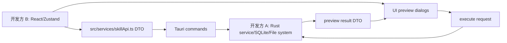
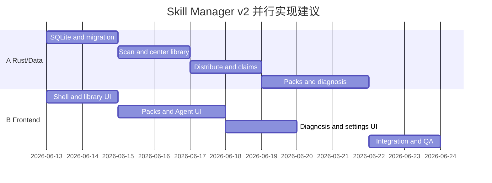

# AgentBro Skill Manager v2 开发交付索引

状态：Draft for parallel implementation
更新时间：2026-06-13

这组文档用于把 Skill Manager v2 同时交给两个开发方实现。请以文档为准，demo 只作为菜单和粗略信息层级参考。

## 文档列表

1. [产品需求设计](./2026-06-13-skill-manager-v2-product-requirements.md)
   - 定义菜单、页面、业务流程、删除/冲突/copy-link/技能包规则。

2. [技术方案](./2026-06-13-skill-manager-v2-technical-design.md)
   - 定义架构、SQLite schema、Tauri commands、DTO、迁移、算法和测试策略。

3. [验收标准](./2026-06-13-skill-manager-v2-acceptance-criteria.md)
   - 定义 P0 验收项、测试环境、主流程脚本、非功能标准和 DoD。

4. [静态 Demo](../design-demos/agentbro-skill-manager-v2-demo.html)
   - 只作为视觉探索参考，不作为验收依据。

## 推荐并行分工

### 开发方 A：数据层与 Tauri/Rust

负责范围：

- SQLite schema/migration。
- 中心库扫描与 JSON 快照。
- Agent inventory 扫描。
- 添加到中心库。
- link/copy 分发。
- target/claim 规则。
- 技能包 apply/remove。
- copy 同步和分叉检测。
- 诊断引擎。
- Rust 单元测试和集成测试。

主要阅读：

- 技术方案全文。
- 产品需求的第 2、5、6、7 节。
- 验收标准全文。

### 开发方 B：前端与交互

负责范围：

- Skill Manager shell。
- Skill 库卡片/列表和详情。
- 技能包列表、创建、应用、撤销 UI。
- Agent 管理 UI。
- 诊断与修复 UI。
- 设置 UI。
- Zustand store 和 `skillApi.ts` 类型对接。
- React 交互测试。

主要阅读：

- 产品需求全文。
- 技术方案的第 4、5、7 节。
- 验收标准全文。

## 对接边界

约定：

- 前端不得直接推断文件系统结果，以 command 返回为准。
- Rust 不负责最终页面排版，但必须返回足够完整的状态和 preview。
- 所有危险操作必须先有 preview DTO。
- DTO 一旦进入前后端联调，字段名不能随意改；需要变更时同步更新三份文档。

## 里程碑

## 验收顺序

1. 先验收数据层：SQLite、扫描、导入、分发、claims、快照。
2. 再验收前端页面：Skill 库、技能包、Agent 管理、诊断、设置。
3. 最后跑完整主流程：导入、分发、创建技能包、应用、诊断、同步、撤销、删除。

任何开发方如果发现文档与现有代码冲突，应先记录冲突点，再提出最小变更方案，不要静默改变核心业务规则。

