# AgentBro Skill Manager v2 产品需求设计

状态：Draft for parallel implementation
更新时间：2026-06-13
适用范围：AgentBro 桌面端 Skill 管理模块

> 本文档是开发依据。`docs/design-demos/agentbro-skill-manager-v2-demo.html` 只作为菜单结构和信息层级参考，最终交互、数据逻辑、验收以本文档和验收标准为准。

## 1. 背景与目标

AgentBro 需要提供一个中心化的 Skill 管理能力，让用户可以统一管理不同 Agent 中安装的 Skills，并支持技能包、诊断、更新、同步、冲突处理等日常维护工作。

当前用户痛点：

- 不同 Agent 的 Skill 分散在各自目录中，用户不知道哪些已安装、哪些可复用。
- 手动安装的新 Skill 无法被统一识别，后续同步、更新、删除都不可控。
- 多个 Agent 中出现同名 Skill 时，无法判断来源是否一致，也无法安全处理冲突。
- 缺少预设技能包能力，无法一键给多个 Agent 应用或撤销同一组 Skills。
- copy 与 link 的语义不清晰，copy 副本修改后缺少同步决策。
- MCP、Plugin、Agent 版本状态与 Skills 管理割裂，排障成本高。

产品目标：

- 建立统一中心库：`~/.agentbro/skills`。
- 支持从本地、Agent 目录、远程来源将 Skill 纳入中心库管理。
- 支持将中心库 Skill 以 `link` 或 `copy` 分发到各 Agent。
- 支持技能包：一组中心库 Skill，可叠加应用到多个 Agent，也可撤销。
- 支持 Agent 管理：查看每个 Agent 的版本、Skills、技能包、MCP、Plugin、路径健康。
- 支持一键诊断：发现未管理、可更新、冲突、坏链接、copy 分叉、元数据异常，并给出修复建议。

非目标：

- 本期不做完整远程团队协作市场。
- 本期不做云端账号同步。
- 本期不做 Agent 自身安装器，只展示版本和更新入口，实际更新能力可先接现有 updater 或保留占位。
- 本期不重新设计 Notch/Overlay 主流程。

## 2. 核心概念

| 概念 | 定义 |
| --- | --- |
| 中心库 | AgentBro 统一管理的本地 Skill 仓库，默认路径 `~/.agentbro/skills`。 |
| 中心库 Skill | 已进入中心库且被 AgentBro 记录元数据的 Skill。目录名作为默认 Skill ID。 |
| Agent Skill | 某个 Agent 自己目录中的 Skill，可能已被 AgentBro 管理，也可能是用户手动安装的未管理 Skill。 |
| Target | 一个 Skill 在一个 Agent 中的实际安装记录。 |
| Claim | 安装原因。可能是 direct，也可能来自某个技能包。一个 Target 可以有多个 Claim。 |
| 技能包 | 一组中心库 Skill ID。技能包不绑定 Agent，不绑定 link/copy。 |
| link | Agent 目录下创建软链接，指向中心库 Skill。中心库更新后自动生效。 |
| copy | 将中心库 Skill 复制到 Agent 目录。后续需要显式同步。 |
| 未管理 | Agent 目录或中心库目录中存在 Skill 文件，但数据库中没有可信记录。 |
| copy 分叉 | 中心库 Skill 和 Agent copy 副本都发生变化，不能自动覆盖。 |

## 3. 信息架构

一级菜单保持五个：

1. Skill 库
2. 技能包
3. Agent 管理
4. 诊断与修复
5. 设置

```mermaid
flowchart TD
  A["Skill Manager v2"] --> B["Skill 库"]
  A --> C["技能包"]
  A --> D["Agent 管理"]
  A --> E["诊断与修复"]
  A --> F["设置"]

  B --> B1["中心库 Skills"]
  B --> B2["卡片/列表切换"]
  B --> B3["Skill 详情"]
  B --> B4["分发到 Agent"]
  B --> B5["加入技能包"]

  C --> C1["技能包列表"]
  C --> C2["创建/编辑技能包"]
  C --> C3["应用到 Agent"]
  C --> C4["撤销应用"]

  D --> D1["已安装 Agent 列表"]
  D --> D2["Agent 详情"]
  D --> D3["Agent Skills"]
  D --> D4["Agent MCP"]
  D --> D5["Agent Plugins"]

  E --> E1["未管理"]
  E --> E2["更新"]
  E --> E3["冲突"]
  E --> E4["坏链接"]
  E --> E5["copy 分叉"]

  F --> F1["中心库路径"]
  F --> F2["默认分发方式"]
  F --> F3["扫描规则"]
  F --> F4["SQLite/JSON 快照"]
```

## 4. 页面需求

### 4.1 Skill 库

定位：以 Skill 为中心浏览和管理中心库，不用横向表格展示所有 Agent。

页面结构：

- 顶部指标：中心库 Skill 数、Agent target 数、未管理数、copy 可更新/分叉数。
- 搜索与筛选：关键字、来源、状态、类型。
- 视图切换：卡片 / 列表。
- Skill 主区：
  - 卡片视图：展示 Skill 名称、描述、来源标签、状态标签、已安装 Agent 图标。
  - 列表视图：更紧凑展示 Skill 名称、来源、已安装 Agent 图标、状态。
- 右侧详情：
  - 名称、描述、中心库路径、来源、安装时间、hash。
  - 已安装 Agent 列表，显示 link/copy/未管理/冲突/分叉。
  - 安装原因 claims。
  - 操作：分发到 Agent、加入技能包、更新 copy、删除、打开目录。

交互要求：

- 点击 Skill 卡片或列表行，右侧详情切换到该 Skill。
- 已安装 Agent 只展示图标，不在主列表铺开所有 Agent 状态。
- 主列表不出现横向 Agent 矩阵。
- 用户可以在 Skill 详情内进入 Agent 维度的详细排查。

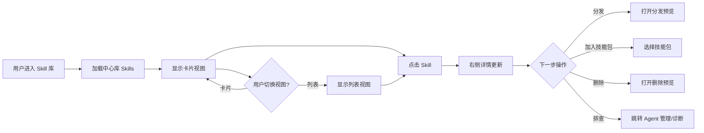

### 4.2 技能包

定位：管理一组中心库 Skills，不直接存 Agent 绑定。

页面结构：

- 左侧技能包列表：名称、成员数、已应用 Agent 数、健康状态。
- 右侧技能包详情：
  - 基本信息。
  - 成员 Skills。
  - 已应用 Agent。
  - pack claims 摘要。
  - 操作：应用、撤销、编辑、复制、删除。
- 创建/编辑流程：
  1. 基本信息：名称、描述、用途、标签。
  2. 选择中心库 Skills。
  3. 预览应用影响：新增、复用、冲突、copy 更新、阻止项。

关键规则：

- 技能包只保存 Skill ID，不保存目标 Agent，不保存 link/copy。
- 一个 Agent 可以应用多个技能包。
- 一个 Skill 可以通过多个技能包和 direct 方式同时安装到同一个 Agent。
- 撤销技能包只移除该技能包产生的 claim。只有当 Target 没有任何 claim 时，才删除 Agent 目录中的文件或链接。

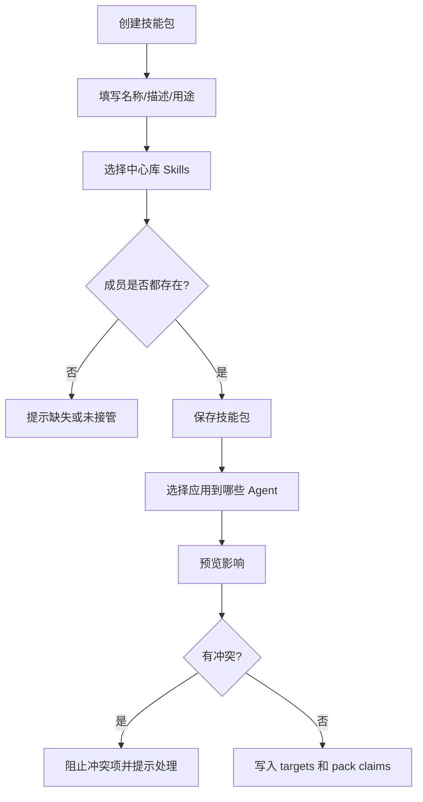

### 4.3 Agent 管理

定位：以 Agent 为中心查看它的完整状态。

页面结构：

- 左侧 Agent 列表：Claude Code、Codex、Gemini、Cursor、OpenCode、自定义 Agent。
- 右侧 Agent 详情：
  - 版本信息：当前版本、可更新版本、安装路径。
  - Skills：已管理、未管理、link、copy、冲突、分叉。
  - 技能包：已应用、可应用、撤销预览。
  - MCP：服务器列表、状态、配置路径、校验结果。
  - Plugins：已安装插件、来源、版本、登录/异常状态。
  - 路径与诊断：技能目录、配置文件、权限、坏链接。

操作：

- 扫描当前 Agent。
- 接管未管理 Skills。
- 应用/撤销技能包。
- 更新 copy 副本。
- 检查 Agent 版本。
- 打开 Agent 目录或配置文件。

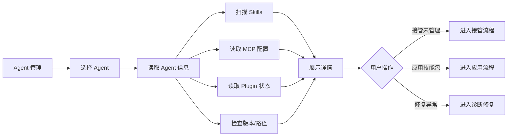

### 4.4 诊断与修复

定位：给出可执行的健康建议，而不是只列问题。

诊断项：

- 中心库存在未入库目录。
- Agent 目录存在未管理 Skill。
- 同名 Skill 来源不同。
- link 指向不存在的中心库目录。
- copy 副本落后中心库。
- copy 分叉。
- SQLite 记录存在，但文件已被手动删除。
- 技能包成员缺失。
- pack claim 存在，但 target 不存在。
- JSON 快照落后。
- MCP 配置无效。
- Plugin 登录或版本异常。

诊断结果分组：

- 可一键修复：坏链接清理、失效 target 清理、JSON 快照刷新。
- 需要确认：接管、覆盖、重命名、删除、copy 分叉。
- 更新建议：远程来源更新、copy 副本同步。
- 技能包健康：缺失成员、孤立 claim。

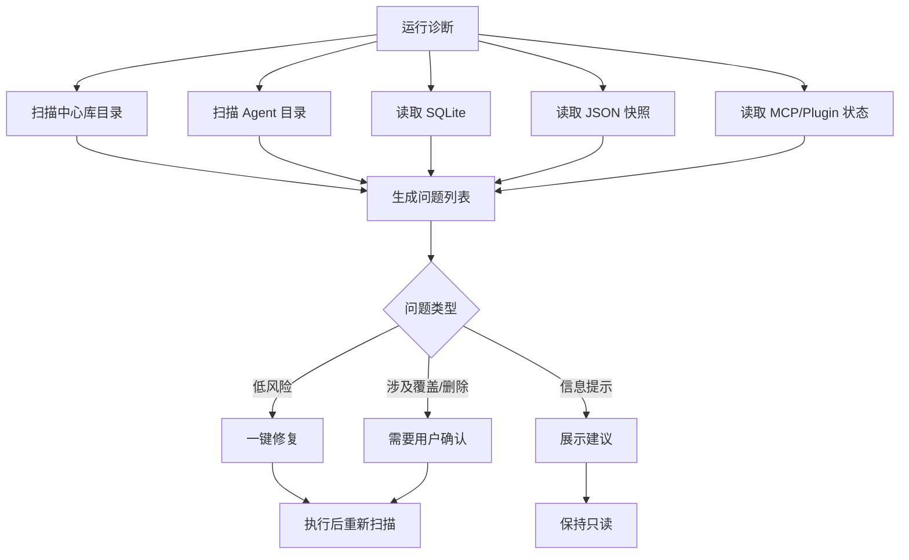

### 4.5 设置

设置项：

- 中心库路径：默认 `~/.agentbro/skills`。
- 默认分发方式：默认 `link`。
- link 失败策略：询问 / 自动 copy。
- 启动扫描：开 / 关。
- 显示未管理 Skills：开 / 关。
- SQLite 路径：`~/.agentbro/skill-manager.db`。
- JSON 快照：刷新、导出、恢复。
- 自定义 Agent：名称、Skill 目录、MCP 配置路径、Plugin 目录。

## 5. 关键业务流程

### 5.1 初次启动

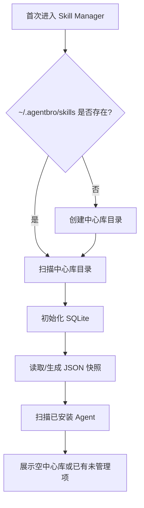

需求：

- 初始中心库可以为空。
- 如果用户手动复制了 Skill 到 `~/.agentbro/skills`，启动扫描必须识别为 `中心库未入库`。
- 不自动把 Agent 目录中的 Skill 导入中心库，必须提示用户确认。

### 5.2 添加到中心库

来源类型：

- 选择文件夹。
- 选择压缩包。
- 从文件夹批量导入。
- 从远程来源安装。
- 从 Agent 目录接管。

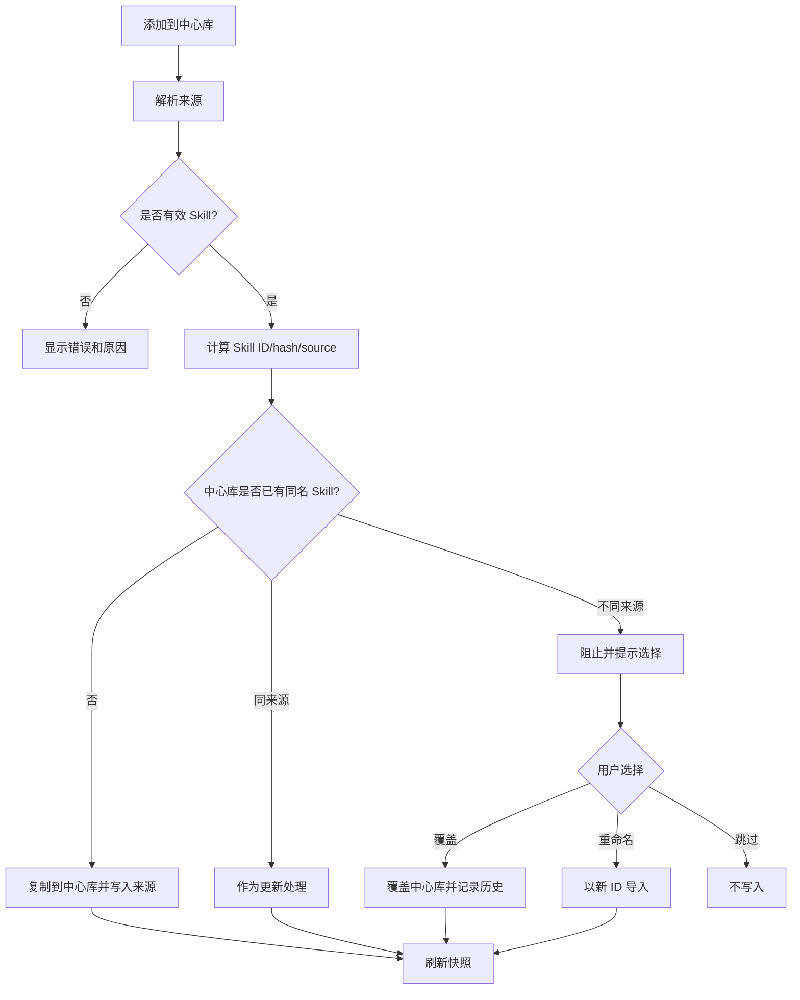

冲突规则：

- 同名同来源：允许更新。
- 同名不同来源：默认阻止。
- 用户必须选择：覆盖、重命名、跳过。
- 覆盖前必须展示影响：哪些 Agent link 会立刻生效，哪些 copy 不会自动生效。

### 5.3 扫描 Agent 并接管

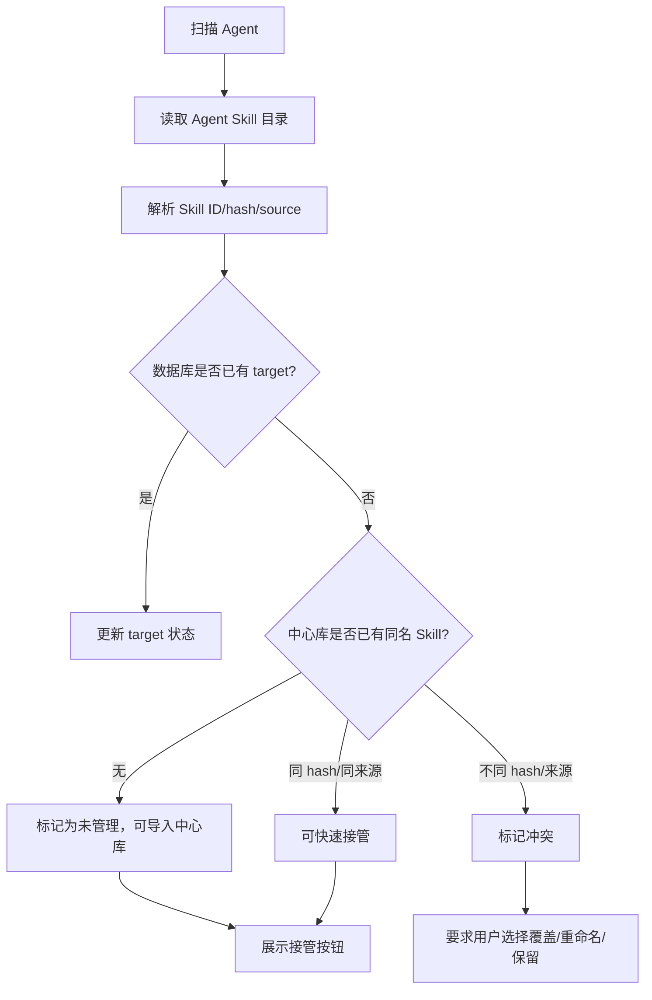

接管规则：

- 从 Agent 导入中心库时，要记录来源 `agent_import` 和原 Agent 路径。
- 原 Agent 目录中的 Skill 不应被静默替换。
- 用户可选择：
  - 保持 Agent 原文件，中心库导入一份。
  - 替换 Agent 为 link。
  - 替换 Agent 为 copy。
  - 跳过。

### 5.4 分发到 Agent

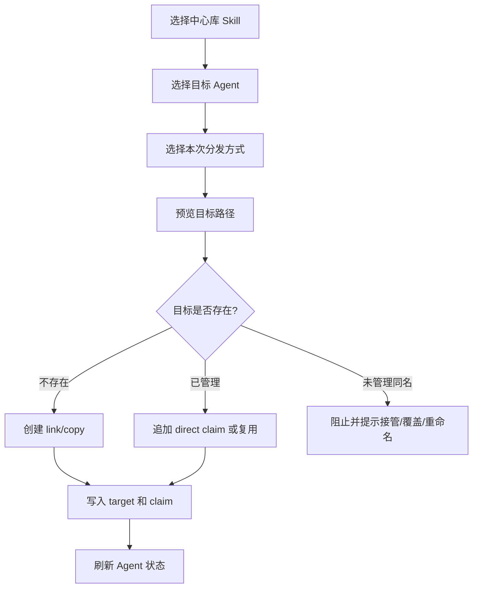

默认分发方式：`link`。

link 失败：

- Unix/macOS：优先软链接。
- Windows 或受限目录：如果 link 失败，根据设置询问或 fallback copy。
- 实际安装模式必须写入数据库，不能只记录用户选择。

### 5.5 copy 同步

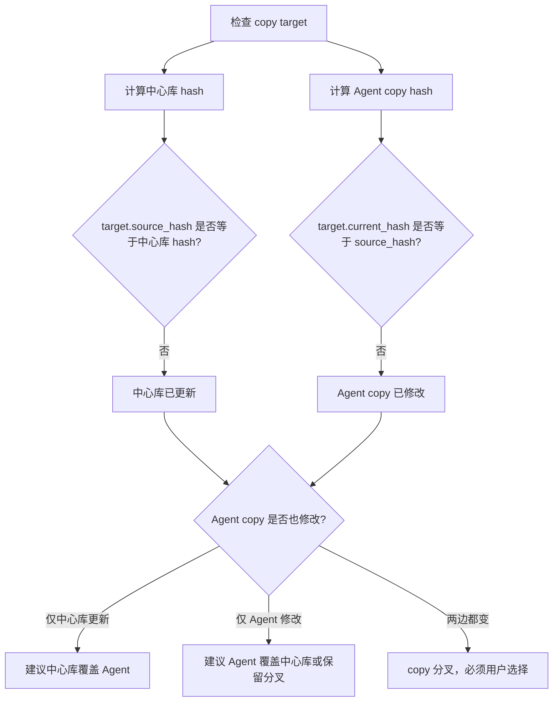

同步动作：

- 中心库覆盖 Agent：更新 Agent copy，并更新 `target.source_hash`。
- Agent 覆盖中心库：更新中心库 Skill，并记录来源为 `agent_override`。
- 保留分叉：保持状态，后续继续提醒。

### 5.6 删除逻辑

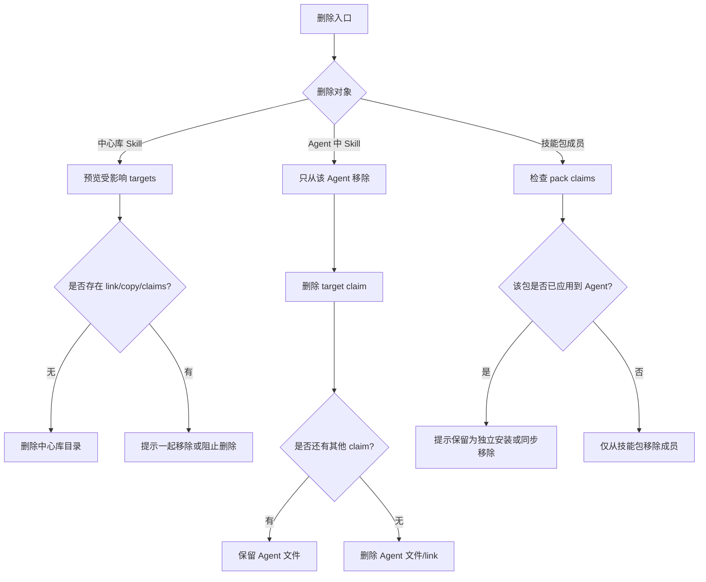

删除规则：

- 删除中心库 Skill：必须预览所有 Agent 影响。
- 在 Agent 中删除：只影响该 Agent，不删除中心库。
- 从技能包移除 Skill：需要检查该技能包是否已应用到 Agent。
- 如果用户选择“不从 Agent 移除”，则删除 pack claim，保留为 direct/孤立独立安装。

## 6. 权限与安全

- 所有会写文件、删除文件、覆盖文件、创建 link 的操作都必须先预览。
- 所有删除中心库或覆盖中心库的动作必须二次确认。
- 不允许自动删除用户未管理的 Agent Skill。
- 不允许把不同来源同名 Skill 自动合并。
- 所有失败操作需要保留可读错误原因和建议下一步。

## 7. MVP 范围

P0 必须完成：

- 中心库扫描和元数据记录。
- Skill 库卡片/列表视图和详情。
- Agent 管理详情。
- 添加到中心库。
- 扫描 Agent 并接管。
- link/copy 分发。
- 技能包创建、应用、撤销。
- copy 更新/分叉检测。
- 一键诊断基础项。
- SQLite 主存储 + JSON 快照。

P1 可延后：

- 远程市场多源订阅。
- Agent 自身版本自动更新。
- 完整 Plugin 安装/升级。
- 高级搜索和标签体系。
- 操作历史回滚 UI。

