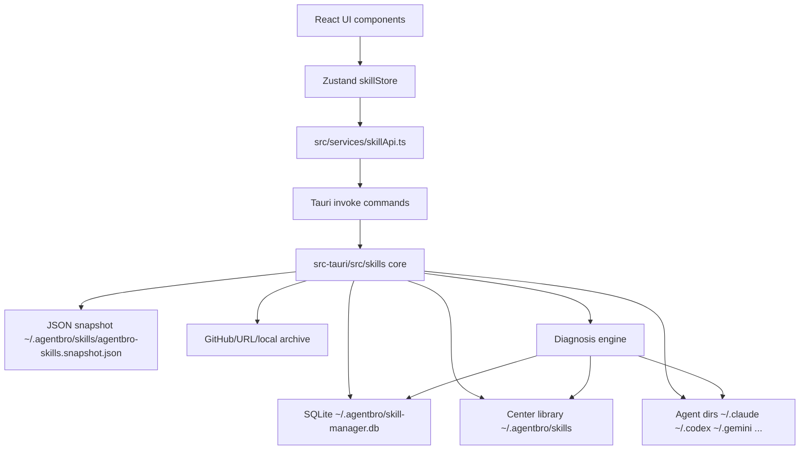
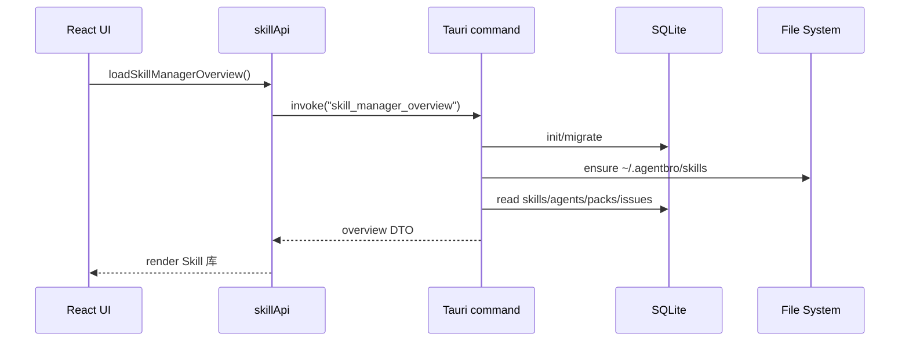
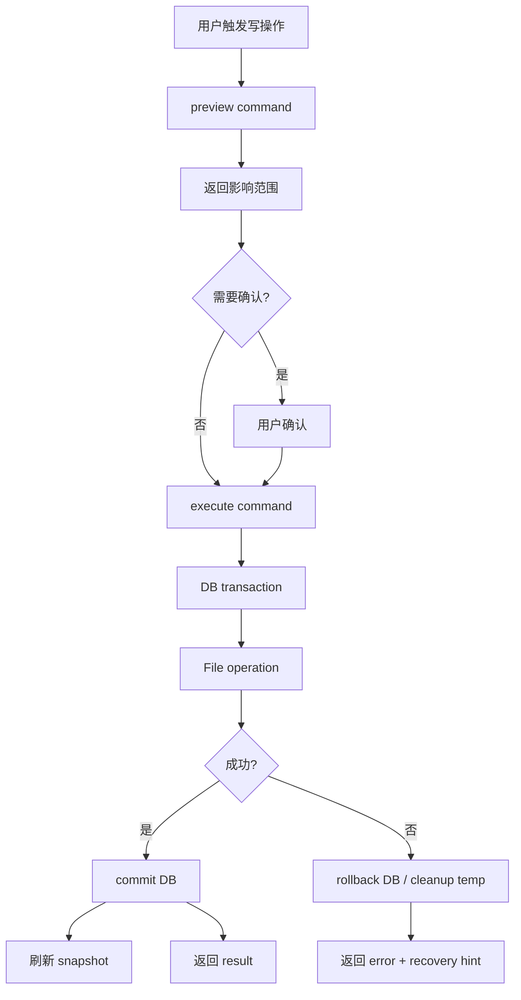
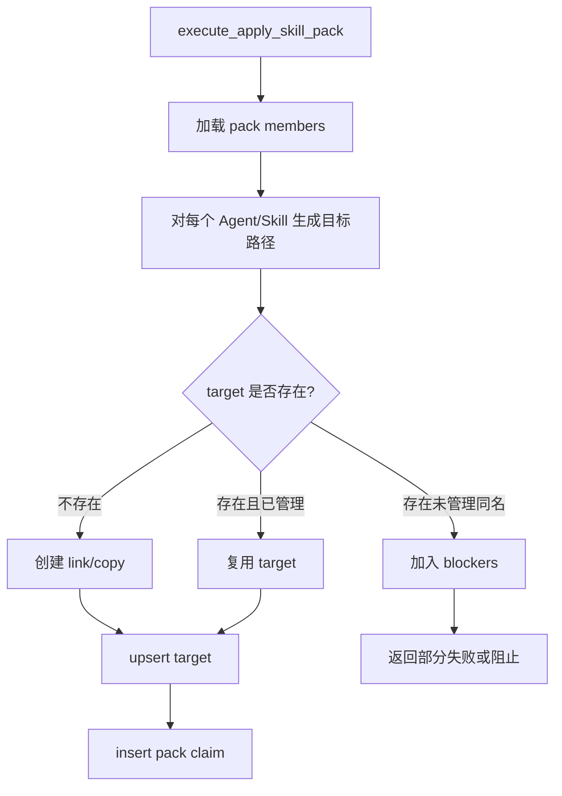
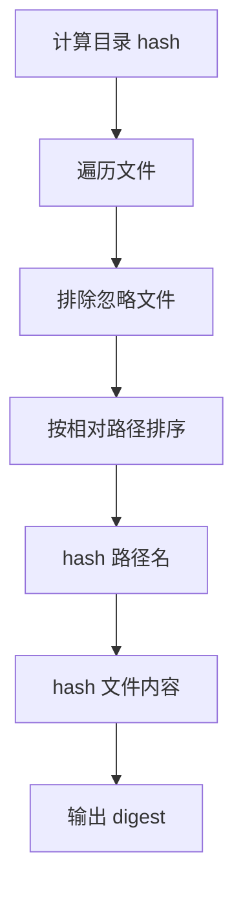
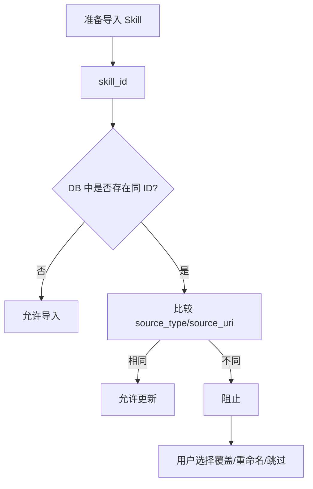
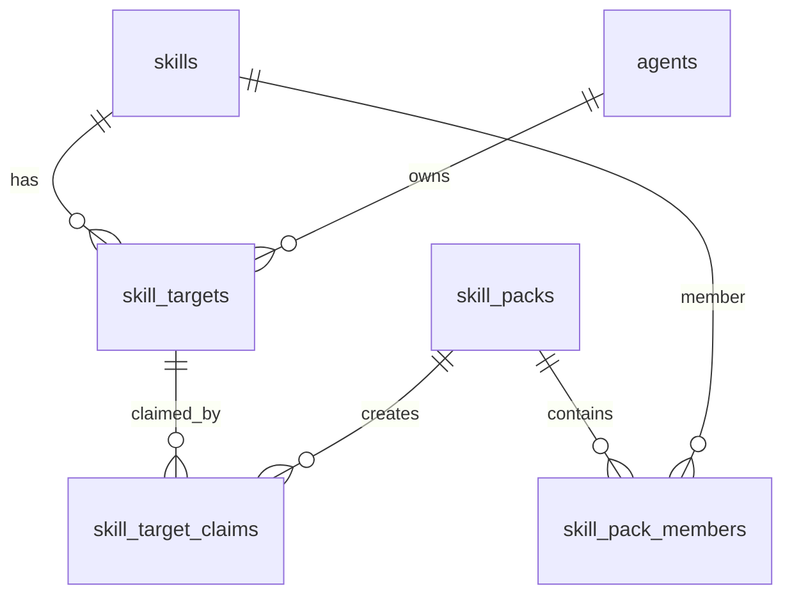
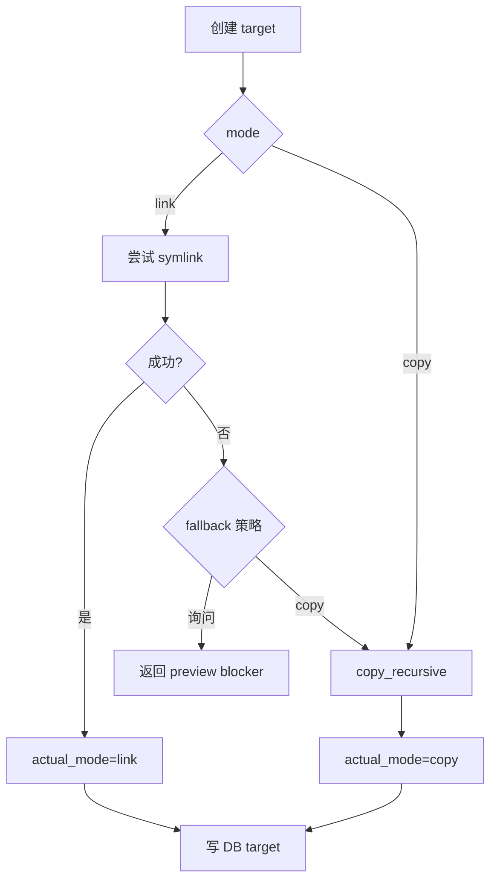
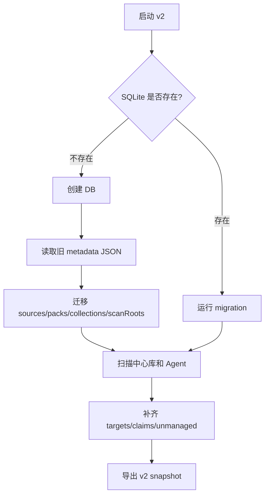

# AgentBro Skill Manager v2 技术方案

状态：Draft for parallel implementation
更新时间：2026-06-13
适用范围：AgentBro 桌面端 Skill 管理模块

## 1. 技术目标

在现有 `src/components/skills/*`、`src/services/skillApi.ts`、`src/stores/skillStore.ts`、`src-tauri/src/skills/*` 基础上升级 Skill Manager。目标是建立可靠的本地状态模型，让 UI、扫描、安装、技能包、诊断都围绕同一套 SQLite 数据工作。

关键技术原则：

- SQLite 作为主存储。
- `~/.agentbro/skills` 作为中心库文件事实。
- JSON 快照作为备份、人工排查、迁移辅助，不作为主存储。
- 所有写文件操作先 preview，再 execute。
- 所有跨 Agent 操作具备幂等性。
- `copy` 与 `link` 的实际结果必须可追踪。
- 旧 metadata JSON 需要迁移，不直接丢弃。

## 2. 总体架构



建议模块拆分：

| 层 | 文件建议 | 职责 |
| --- | --- | --- |
| Frontend Components | `src/components/skills-v2/*` 或逐步替换 `src/components/skills/*` | Skill 库、技能包、Agent 管理、诊断、设置 UI。 |
| Frontend Store | `src/stores/skillStore.ts` | 页面状态、缓存数据、选中项、loading、操作结果。 |
| Frontend API | `src/services/skillApi.ts` | TypeScript 类型和 Tauri command 封装。 |
| Rust Commands | `src-tauri/src/skills/commands.rs` | 对外 command，参数校验，调用 core。 |
| Rust Models | `src-tauri/src/skills/models.rs` | DTO、DB model、枚举。 |
| Rust DB | `src-tauri/src/skills/db.rs` | SQLite schema、migration、事务。 |
| Core Service | `src-tauri/src/skills/service.rs` | 中心库、扫描、安装、删除、同步、技能包业务逻辑。 |
| Agent Registry | `src-tauri/src/skills/agent_paths.rs` | 复用现有 Agent 路径能力，扩展版本/MCP/Plugin 状态。 |
| Diagnosis | `src-tauri/src/skills/diagnosis.rs` | 诊断问题生成、修复 preview/execute。 |
| Snapshot | `src-tauri/src/skills/snapshot.rs` | JSON 快照导出/恢复。 |

## 3. 存储设计

### 3.1 文件路径

默认路径：

- 中心库：`~/.agentbro/skills`
- SQLite：`~/.agentbro/skill-manager.db`
- JSON 快照：`~/.agentbro/skills/agentbro-skills.snapshot.json`
- 旧 metadata：沿用当前 `agent_paths::agentbro_metadata_path()`，首次启动迁移后保留。

### 3.2 SQLite Schema

建议 schema version：`2`。

```sql
CREATE TABLE IF NOT EXISTS schema_migrations (
  version INTEGER PRIMARY KEY,
  applied_at TEXT NOT NULL
);

CREATE TABLE IF NOT EXISTS skills (
  id TEXT PRIMARY KEY,
  name TEXT NOT NULL,
  description TEXT NOT NULL DEFAULT '',
  skill_type TEXT NOT NULL DEFAULT 'skill',
  center_path TEXT NOT NULL,
  current_hash TEXT NOT NULL,
  frontmatter_json TEXT NOT NULL DEFAULT '{}',
  created_at TEXT NOT NULL,
  updated_at TEXT NOT NULL,
  last_scanned_at TEXT
);

CREATE TABLE IF NOT EXISTS skill_sources (
  skill_id TEXT PRIMARY KEY REFERENCES skills(id) ON DELETE CASCADE,
  source_type TEXT NOT NULL,
  source_uri TEXT,
  source_ref TEXT,
  imported_from_agent TEXT,
  imported_from_path TEXT,
  installed_via TEXT NOT NULL,
  created_at TEXT NOT NULL,
  updated_at TEXT NOT NULL
);

CREATE TABLE IF NOT EXISTS agents (
  id TEXT PRIMARY KEY,
  display_name TEXT NOT NULL,
  skills_dir TEXT,
  config_path TEXT,
  mcp_config_path TEXT,
  plugin_dir TEXT,
  version TEXT,
  latest_version TEXT,
  enabled INTEGER NOT NULL DEFAULT 1,
  last_scanned_at TEXT
);

CREATE TABLE IF NOT EXISTS skill_targets (
  id TEXT PRIMARY KEY,
  skill_id TEXT NOT NULL REFERENCES skills(id) ON DELETE CASCADE,
  agent_id TEXT NOT NULL REFERENCES agents(id) ON DELETE CASCADE,
  target_path TEXT NOT NULL,
  install_mode TEXT NOT NULL,
  actual_mode TEXT NOT NULL,
  source_hash TEXT NOT NULL,
  current_hash TEXT,
  status TEXT NOT NULL,
  created_at TEXT NOT NULL,
  updated_at TEXT NOT NULL,
  UNIQUE(skill_id, agent_id, target_path)
);

CREATE TABLE IF NOT EXISTS skill_target_claims (
  id TEXT PRIMARY KEY,
  target_id TEXT NOT NULL REFERENCES skill_targets(id) ON DELETE CASCADE,
  claim_type TEXT NOT NULL,
  pack_id TEXT,
  created_at TEXT NOT NULL,
  UNIQUE(target_id, claim_type, pack_id)
);

CREATE TABLE IF NOT EXISTS skill_packs (
  id TEXT PRIMARY KEY,
  name TEXT NOT NULL,
  description TEXT NOT NULL DEFAULT '',
  tags_json TEXT NOT NULL DEFAULT '[]',
  created_at TEXT NOT NULL,
  updated_at TEXT NOT NULL
);

CREATE TABLE IF NOT EXISTS skill_pack_members (
  pack_id TEXT NOT NULL REFERENCES skill_packs(id) ON DELETE CASCADE,
  skill_id TEXT NOT NULL REFERENCES skills(id) ON DELETE CASCADE,
  sort_order INTEGER NOT NULL DEFAULT 0,
  required INTEGER NOT NULL DEFAULT 1,
  PRIMARY KEY(pack_id, skill_id)
);

CREATE TABLE IF NOT EXISTS unmanaged_items (
  id TEXT PRIMARY KEY,
  item_type TEXT NOT NULL,
  agent_id TEXT,
  path TEXT NOT NULL,
  inferred_skill_id TEXT,
  hash TEXT,
  reason TEXT NOT NULL,
  first_seen_at TEXT NOT NULL,
  last_seen_at TEXT NOT NULL
);

CREATE TABLE IF NOT EXISTS diagnosis_issues (
  id TEXT PRIMARY KEY,
  issue_type TEXT NOT NULL,
  severity TEXT NOT NULL,
  entity_type TEXT NOT NULL,
  entity_id TEXT,
  title TEXT NOT NULL,
  detail TEXT NOT NULL,
  fix_kind TEXT NOT NULL,
  payload_json TEXT NOT NULL DEFAULT '{}',
  created_at TEXT NOT NULL,
  resolved_at TEXT
);

CREATE TABLE IF NOT EXISTS operations (
  id TEXT PRIMARY KEY,
  operation_type TEXT NOT NULL,
  status TEXT NOT NULL,
  preview_json TEXT NOT NULL DEFAULT '{}',
  result_json TEXT NOT NULL DEFAULT '{}',
  error TEXT,
  created_at TEXT NOT NULL,
  completed_at TEXT
);

CREATE INDEX IF NOT EXISTS idx_skill_targets_agent ON skill_targets(agent_id);
CREATE INDEX IF NOT EXISTS idx_claims_pack ON skill_target_claims(pack_id);
CREATE INDEX IF NOT EXISTS idx_issues_type ON diagnosis_issues(issue_type, resolved_at);
```

状态枚举建议：

| 字段 | 可选值 |
| --- | --- |
| `install_mode` | `link`, `copy` |
| `actual_mode` | `link`, `copy` |
| `target.status` | `ok`, `unmanaged`, `conflict`, `broken_link`, `copy_outdated`, `copy_modified`, `copy_diverged`, `missing` |
| `claim_type` | `direct`, `pack` |
| `source_type` | `local_folder`, `archive`, `github`, `url`, `agent_import`, `manual_center`, `marketplace` |
| `fix_kind` | `auto`, `confirm`, `manual`, `info` |

### 3.3 JSON 快照

快照文件：`~/.agentbro/skills/agentbro-skills.snapshot.json`

用途：

- 用户人工排查。
- 导出备份。
- SQLite 损坏时恢复。
- 给外部开发/调试看系统状态。

快照结构：

```json
{
  "schemaVersion": 2,
  "exportedAt": "2026-06-13T12:00:00Z",
  "centerPath": "~/.agentbro/skills",
  "skills": [],
  "sources": [],
  "agents": [],
  "targets": [],
  "claims": [],
  "packs": [],
  "diagnosisSummary": {}
}
```

写入策略：

- 每次写操作成功后异步刷新快照。
- 诊断页提供手动刷新。
- 快照失败不阻止主操作，但必须记录 warning。

## 4. 数据流

### 4.1 启动加载



### 4.2 写操作统一流程



实现要求：

- 复杂写操作必须有 `preview` 和 `execute` 两个 command。
- 文件操作尽量使用临时目录/临时文件，完成后 rename。
- DB 与文件系统无法真正原子化，必须记录 operation，失败后提供恢复建议。

## 5. Rust Command 设计

保留兼容旧 command，但新增 v2 command。前端新页面只调用 v2。

### 5.1 Overview

```ts
type SkillManagerOverview = {
  metrics: {
    centerSkillCount: number
    targetCount: number
    unmanagedCount: number
    issueCount: number
  }
  skills: SkillSummary[]
  agents: AgentSummary[]
  packs: SkillPackSummary[]
  issues: DiagnosisIssue[]
  settings: SkillManagerSettings
}
```

Commands：

- `skill_manager_init`
- `skill_manager_overview`
- `skill_manager_refresh`
- `skill_manager_export_snapshot`
- `skill_manager_import_snapshot`

### 5.2 Skill 库

```ts
type SkillSummary = {
  id: string
  name: string
  description: string
  skillType: 'skill' | 'plugin' | 'mcp'
  sourceType: string
  sourceUri: string | null
  centerPath: string
  currentHash: string
  status: 'ok' | 'updateAvailable' | 'conflict' | 'unmanaged' | 'copyDiverged'
  installedAgents: Array<{
    agentId: string
    displayName: string
    iconKey: string
    mode: 'link' | 'copy'
    status: string
  }>
}

type SkillDetail = SkillSummary & {
  frontmatter: Record<string, string>
  files: FileTreeNode | null
  targets: SkillTargetDetail[]
  source: SkillSourceDetail | null
}
```

Commands：

- `list_center_skills`
- `get_skill_detail`
- `preview_add_center_skill`
- `execute_add_center_skill`
- `preview_delete_center_skill`
- `execute_delete_center_skill`
- `open_skill_path`

### 5.3 分发与接管

Commands：

- `preview_distribute_skill`
- `execute_distribute_skill`
- `scan_agent_inventory`
- `preview_adopt_agent_skill`
- `execute_adopt_agent_skill`
- `preview_sync_copy_target`
- `execute_sync_copy_target`

核心 DTO：

```ts
type DistributionPreview = {
  skillIds: string[]
  targetAgents: string[]
  requestedMode: 'link' | 'copy'
  changes: Array<{
    skillId: string
    agentId: string
    action: 'create' | 'reuse' | 'appendClaim' | 'skip' | 'blocked'
    actualMode?: 'link' | 'copy'
    reason?: string
    targetPath: string
  }>
  blockers: Array<ConflictBlocker>
}
```

### 5.4 技能包

Commands：

- `list_skill_packs_v2`
- `get_skill_pack_detail`
- `preview_upsert_skill_pack`
- `execute_upsert_skill_pack`
- `preview_apply_skill_pack`
- `execute_apply_skill_pack`
- `preview_remove_skill_pack_from_agent`
- `execute_remove_skill_pack_from_agent`
- `preview_remove_skill_from_pack`
- `execute_remove_skill_from_pack`

技能包应用逻辑：



### 5.5 Agent 管理

Commands：

- `list_managed_agents`
- `get_agent_detail`
- `scan_agent_detail`
- `check_agent_version`
- `list_agent_mcp_servers`
- `validate_agent_mcp_server`
- `list_agent_plugins`

Agent 详情 DTO：

```ts
type AgentDetail = {
  id: string
  displayName: string
  version: string | null
  latestVersion: string | null
  skillsDir: string | null
  configPath: string | null
  mcpConfigPath: string | null
  pluginDir: string | null
  skills: SkillTargetDetail[]
  appliedPacks: AppliedPackSummary[]
  availablePacks: SkillPackSummary[]
  mcpServers: McpServerStatus[]
  plugins: PluginStatus[]
  health: AgentHealthIssue[]
}
```

### 5.6 诊断

Commands：

- `run_skill_manager_diagnosis`
- `list_diagnosis_issues`
- `preview_fix_diagnosis_issue`
- `execute_fix_diagnosis_issue`
- `execute_safe_fixes`

诊断引擎输入：

- DB 当前记录。
- 中心库目录扫描结果。
- Agent 目录扫描结果。
- MCP config 文件状态。
- Plugin 目录/登录状态。
- JSON 快照 mtime/hash。

诊断引擎输出：

```ts
type DiagnosisIssue = {
  id: string
  issueType: string
  severity: 'info' | 'warning' | 'error'
  fixKind: 'auto' | 'confirm' | 'manual' | 'info'
  title: string
  detail: string
  entityType: 'skill' | 'target' | 'pack' | 'agent' | 'mcp' | 'plugin' | 'snapshot'
  entityId: string | null
  actions: Array<{
    id: string
    label: string
    destructive: boolean
  }>
}
```

## 6. 核心算法

### 6.1 Skill ID 与 Hash

Skill ID：

- 默认使用中心库目录名。
- 导入时目录名需要 sanitize。
- 同名冲突时，重命名格式建议：`{skill-id}-{short-source}` 或用户自定义。

Hash：

- 对目录内所有文件做稳定 hash。
- 排除：`.DS_Store`、临时文件、`.git`、缓存目录。
- 排序后按相对路径 + 文件内容计算。
- link target 计算中心库 hash，copy target 计算自身目录 hash。



### 6.2 冲突判断



### 6.3 Target 与 Claim

一个 Target 表示实际文件，一个 Claim 表示安装原因。



删除 Agent 中 Skill：

- 删除指定 claim。
- 如果 target 还有其他 claim，保留文件。
- 如果 target 没有 claim，删除 target 文件或 link，并删除 DB target。

### 6.4 link/copy 创建



### 6.5 迁移策略

现状有 JSON metadata 和现有扫描逻辑。迁移流程：



迁移要求：

- 旧 `packs` 迁移为 `skill_packs` 和 `skill_pack_members`。
- 旧 `sources` 迁移为 `skill_sources`。
- 旧 `collections` 可保留为兼容数据，或转成非核心集合功能。
- 迁移不可删除旧 metadata。
- 迁移失败不能破坏现有 Skill 文件。

## 7. 前端设计

### 7.1 Store 状态

建议扩展 `skillStore`：

```ts
type SkillManagerTab = 'library' | 'packs' | 'agents' | 'diagnostics' | 'settings'
type SkillViewMode = 'cards' | 'list'

type SkillManagerState = {
  activeTab: SkillManagerTab
  overview: SkillManagerOverview | null
  selectedSkillId: string | null
  selectedSkillDetail: SkillDetail | null
  selectedPackId: string | null
  selectedAgentId: string | null
  skillViewMode: SkillViewMode
  filters: {
    query: string
    source: string
    status: string
    type: string
  }
  pendingPreview: OperationPreview | null
}
```

### 7.2 页面组件

建议组件：

- `SkillManagerShell`
- `SkillLibraryPage`
- `SkillCard`
- `SkillListRow`
- `SkillDetailPanel`
- `SkillPackPage`
- `SkillPackBuilder`
- `ApplyPackDialog`
- `AgentManagementPage`
- `AgentDetailPanel`
- `DiagnosisPage`
- `FixIssueDialog`
- `SkillManagerSettingsPage`

### 7.3 UI 行为

- Skill 库主列表不展示 Agent 矩阵。
- Skill 卡片/列表使用 Agent 图标展示已安装 Agent。
- 点击主列表项必须在右侧展示详情。
- 任何覆盖/删除/接管操作必须打开 preview dialog。
- 诊断页的“一键修复”只执行低风险项。

## 8. 测试策略

Rust 单元测试：

- Hash 稳定性。
- Source conflict 判断。
- Target/claim 删除规则。
- pack apply/remove。
- copy sync 状态判断。
- migration。
- diagnosis issue 生成。

前端单元测试：

- Skill 库卡片/列表切换。
- 点击 Skill 更新详情。
- 技能包创建步骤。
- Agent 管理详情 tab。
- 诊断项分组和按钮状态。

集成测试：

- 临时目录模拟 `~/.agentbro/skills` 和 Agent 目录。
- 导入 Skill 到中心库。
- 分发 link/copy。
- 应用/撤销技能包。
- 删除中心库 Skill preview。
- copy 分叉处理。

命令：

- `pnpm test:run`
- `pnpm build`
- Rust tests：在 `src-tauri` 下运行 `cargo test`

## 9. 实施阶段

Phase 1：存储和扫描

- SQLite schema/migration。
- 中心库扫描。
- Agent inventory 扫描。
- JSON 快照。

Phase 2：Skill 库与分发

- Skill library UI。
- Skill detail。
- add center / distribute preview/execute。
- copy/link 状态。

Phase 3：技能包

- pack CRUD。
- apply/remove pack。
- claims 规则。

Phase 4：Agent 管理与诊断

- Agent detail。
- MCP/Plugin 状态读取。
- diagnosis engine。
- safe fixes。

Phase 5：收口

- 迁移兼容。
- 错误处理。
- 文档/测试补齐。
- 视觉与可用性 QA。

